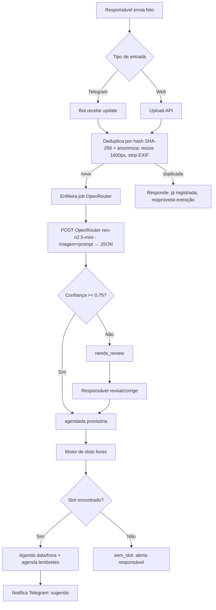
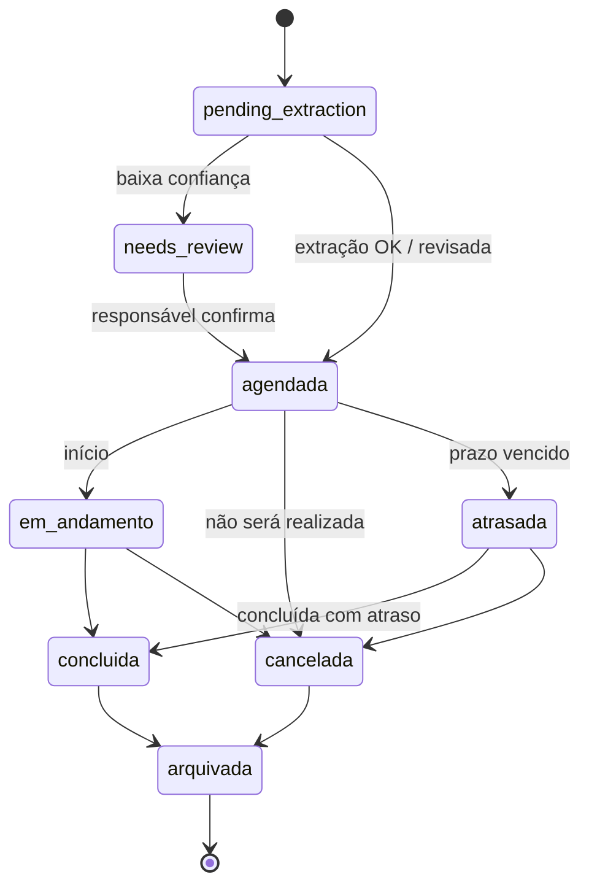
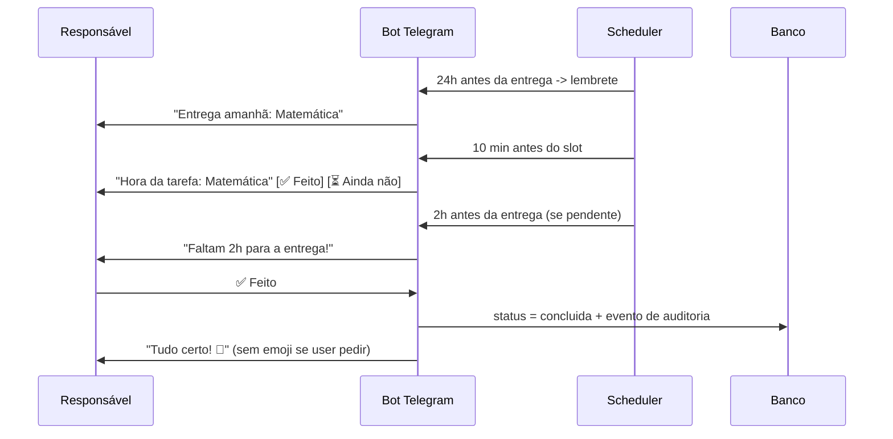

# PRD — Hora da Tarefa

> **Status:** Beta (VPS)
> **Versão:** 1.2 (OpenRouter pago + polling)
> **Última atualização:** 2026-09-23
> **Responsável:** Product Owner (a definir)
> **Classificação:** Documento de requisitos de produto (PRD)

---

## 1. Visão Geral

### 1.1 Resumo Executivo

O **Hora da Tarefa** é um SaaS que ajuda pais e responsáveis a organizar a lição de casa dos filhos de ponta a ponta. O responsável envia uma foto da tarefa (caderno, agenda ou bilhete escolar) via app web ou Telegram; o modelo multimodal `nex-agi/nex-n2.5-mini` via API OpenRouter (OpenAI-compatible, `https://openrouter.ai/api/v1`) recebe imagem + texto e extrai data de envio, data de entrega, matéria e enunciado em JSON validado. O sistema cruza essas informações com a grade escolar e as atividades extraescolares da criança para sugerir automaticamente o melhor dia e horário livre, e então dispara lembretes e cobranças de conclusão via bot do Telegram.

O valor central é **transformar uma foto desorganizada em um compromisso agendado, lembrado e concluído** — sem planilhas, sem esquecimentos e com custo irrisório de IA (OpenRouter pago, sem VLM local na VPS).

### 1.2 Problema

Pais e responsáveis enfrentam diariamente:

- **Fragmentação da informação:** a lição chega por caderno, agenda de papel, bilhete, grupo de WhatsApp da escola e fala do filho — nunca em um só lugar.
- **Falta de contexto de tempo:** mesmo sabendo da tarefa, o responsável não sabe *quando* a criança terá tempo livre, considerando aula, natação, inglês, terapia e sono.
- **Esquecimento e atraso:** entregas perdidas geram cobrança da escola e conflito familiar.
- **Custo de ferramentas de IA:** soluções que usam APIs de visão pagas (GPT-4o, Gemini Pro) cobram por imagem e por token, inviabilizando preço popular no Brasil. O MVP usa o modelo pago OpenRouter (`nex-agi/nex-n2.5-mini`, multimodal texto+imagem, 262k contexto, US$ 0,025/0,10 por 1M tokens), com custo de centavos por mil extrações e rate limit gerenciado por fila + retry.
- **Sobrecarga cognitiva:** a "gestão da lição de casa" hoje é feita de memória e boa vontade, sem sistema de acompanhamento nem histórico.

**Por que agora:** modelos multimodais via OpenRouter (Nex-N2.5-Mini — MoE multimodal 35B/3B ativos, 262k contexto) entregam OCR + extração semântica direto da imagem via API, sem precisar de GPU/VPS parruda — hoje no tier **pago** (estabilidade no beta), com `:free` como contingência. Isso elimina a complexidade de VLM quantizado local (SmolVLM2, Moondream2, Qwen2-VL-2B em CPU) e libera a VPS de 1 vCPU / 4GB para só API + banco + fila. Privacidade é tratada por anonimização pré-envio (redimensionar, remover EXIF, hash SHA-256, sem PII em logs; a LLM recebe derivada de 1024px, original íntegro no storage).

### 1.3 Solução Proposta

Um fluxo em quatro etapas:

1. **Entrada por foto** — responsável envia imagem no Telegram (ou web upload).
2. **Extração via OpenRouter** — anonimização local (resize, strip EXIF, hash) + chamada multimodal ao `nex-agi/nex-n2.5-mini` que devolve **JSON validado por schema** (sem OCR/VLM local).
3. **Motor de agendamento** — cruza matéria, prazo e disponibilidade da criança (grade escolar + atividades fixas + sono + deslocamento) e calcula o(s) slot(s) livres com folga.
4. **Orquestração por Telegram** — confirma o agendamento, envia lembretes (24h/2h antes) e coleta a confirmação de conclusão, alimentando um dashboard de status.

O produto é **assistivo, não substitutivo**: a IA propõe, o responsável confirma. Toda extração incerta é submetida a revisão humana antes de virar compromisso.

### 1.4 Objetivos do Produto

- **Objetivo 1:** Reduzir o tempo de registro de uma tarefa de ~3 minutos (digitação) para **≤ 30 segundos** (foto + confirmação).
- **Objetivo 2:** Atingir **≥ 85% de precisão** de extração automática nos campos críticos (data de entrega e matéria), com revisão humana no restante.
- **Objetivo 3:** Reduzir a taxa de tarefas atrasadas em **≥ 40%** nos primeiros 60 dias de uso por família ativa.
- **Objetivo 4:** Operar o núcleo de IA a **custo marginal ≤ R$ 0,01 por imagem** (`nex-agi/nex-n2.5-mini` pago), sem VLM local. Monitorar tokens e gasto mensal (logs em `extraction_json.meta`); manter backoff + cache por hash.
- **Objetivo 5:** Manter o stack completo rodando em **1 vCPU / 4GB RAM / 50GB disco** (sem carga de IA local — só API, Postgres, Redis, bot).

### 1.5 Não-Objetivos (Out of Scope estratégico)

- Não é um sistema escolar oficial, não substitui o portal do aluno nem o diário de classe do professor.
- Não realiza correção pedagógica, resolução de exercícios, tradução ou explicação de conteúdo (o produto organiza, não ensina).
- Não opera como rede social entre pais ou turmas.
- Não oferece chat conversacional geral de IA.
- Não faz controle financeiro de mesada, nota ou boletim escolar (avaliar pós-MVP).
- Não é multiplataforma nativa (iOS/Android) no MVP — usará web responsivo + Telegram.

---

## 2. Público-alvo & Personas

### 2.1 Perfil de mercado (ICP)

- **Quem:** famílias com crianças de **6 a 14 anos** (Ensino Fundamental), nas classes B/C, com rotina estruturada (escola + atividades extra).
- **Contexto:** ao menos um responsável com smartphone e Telegram ativo; criança com agenda/caderno escolar físico.
- **Dor econômica:** sensível a preço, compara com apps de organização familiar já existentes.

### 2.2 Persona Principal — Carlos, o Pai "Gerente de Agenda" (usuário decisor)

- **Perfil:** 38 anos, analista de TI, casado, dois filhos (9 e 12 anos), mora em capital. Trabalha híbrido, é ele quem paga a assinatura.
- **Dores:** perde bilhetes de tarefa no meio de grupos de WhatsApp; não sabe a grade de aulas dos filhos de cor; já levou bronca por tarefa não feita; detesta digitar.
- **Ganhos esperados:** registrar tarefa tirando foto; receber alerta dizendo *exatamente quando* fazer; ter um painel do que está pendente/atrasado sem esforço.
- **Cenário de uso:** à noite, tira foto da agenda — a tarefa é registrada e agendada para o dia seguinte às 17h30 (após o inglês). Recebe lembrete às 17h20 e confirma a conclusão às 18h10.

### 2.3 Persona Secundária — Mariana, a Mãe "Executora" (usuário operacional)

- **Perfil:** 36 anos, professora, segunda responsável cadastrada. Fica com as crianças à tarde.
- **Dores:** precisa saber o que já foi feito e o que ainda falta *agora*; não confia no "já fiz" do filho; quer histórico para conversar com a professora.
- **Ganhos esperados:** dashboard simples com pendentes do dia, botão de confirmar/cancelar tarefa, histórico por matéria.
- **Cenário de uso:** consulta a aba "Hoje" no app web e marca "concluída" após conferir o caderno.

### 2.4 Persona Terciária — Miguel, o Filho (9 anos) (usuário indireto/beneficiário)

- **Perfil:** 4º ano, faz natação (ter/qui) e inglês (seg/qua). Usa o celular do responsável ocasionalmente.
- **Dores:** interrompe o lazer sem saber o prazo; esquece o que foi combinado.
- **Ganhos esperados:** ser lembrado em linguagem simples ("faltam 2 horas para a tarefa de matemática"); marcar "feito" com um toque.
- **Cenário de uso (pós-MVP):** recebe notificação no dispositivo da família com atalho "já fiz".

### 2.5 Persona Quaternária — Prof. Ana, a Professora (ator externo eventual)

- **Perfil:** professora do Fundamental, envia bilhetes e roteiros de tarefa.
- **Papel no produto:** **fonte indireta de dados** — não é usuária do sistema no MVP; seus bilhetes/cadernos serão fotografados pelos pais.
- **Relevância futura (pós-MVP):** parceria para envio estruturado de tarefas (CSV/link) eliminando a etapa de foto.

### 2.6 Jornadas de Usuário

**Jornada 1 — Registrar tarefa por foto (Carlos)**

1. Carlos abre o Telegram do bot e envia a foto da página do caderno.
2. Bot responde "Recebi! Analisando..." e envia a extração para revisão: *Matéria: Matemática | Entrega: 24/09 | Enunciado: pág. 42, exercícios 1 a 8*.
3. Carlos corrige a data se necessário e confirma.
4. Motor calcula avaliabilidade: quarta 17h30 é o primeiro slot livre com folga ≥ 4h antes do inglês.
5. Bot responde "Agendado para quarta 17h30. Vou te lembrar."

**Jornada 2 — Executar e concluir (Mariana/Miguel)**

1. 17h20 → bot envia "Faltam 10 min para matemática (entrega amanhã)."
2. 18h10 → bot pergunta "Já terminou?" com botões `✅ Feito` / `⏳ Ainda não` / `❌ Cancelar`.
3. Mariana toca `✅ Feito`; tarefa muda para `concluída` e alimenta o dashboard e o histórico.

**Jornada 3 — Recuperar atraso**

1. Se não houver confirmação até 2h antes da entrega, o bot escala lembretes e marca a tarefa como `em risco`.
2. Passado o prazo sem conclusão, o status vira `atrasada` e o dashboard destaca em vermelho.

**Jornada 4 — Cadastro inicial (onboarding)**

1. Carlos cria conta, cadastra a criança, a grade escolar (matéria × dia × hora) e as atividades fixas (natação, inglês) com duração e deslocamento.
2. Define a janela de sono (ex.: 22h–07h) e as regras de bloqueio (refeições, lazer protegido).

---

## 3. Escopo MVP vs Pós-MVP (MoSCoW)

### 3.1 Resumo de priorização

| Faixa | Definição | Itens |
|---|---|---|
| **Must** | Sem isso não há produto | Cadastro, grade/atividades, foto→OCR→extração, motor de slots, bot Telegram, CRUD+status, lembretes |
| **Should** | Importante, mas entregável depois | Dashboard analítico, histórico/filtros, multi-criança, multi-responsável |
| **Could** | Desejável | Fallback API externa, calendário semanal visual, templates de tarefa recorrente |
| **Won't (MVP)** | Fora do MVP | App nativo, chat IA geral, integração com portal escolar, gamificação |

### 3.2 MVP (Must + Should essencial)

| ID | Funcionalidade | Prioridade (MoSCoW) | RICE (score est.) |
|----|----------------|---------------------|-------------------|
| RF-01 | Onboarding e cadastro de criança | Must | Alto |
| RF-02 | Cadastro de grade escolar | Must | Alto |
| RF-03 | Cadastro de atividades fixas (com deslocamento) | Must | Alto |
| RF-04 | Upload de foto de tarefa (web + Telegram) | Must | Muito alto |
| RF-05 | Pipeline OCR + extração por VLM/LLM | Must | Muito alto |
| RF-06 | Tela de revisão/confirmação da extração | Must | Alto |
| RF-07 | Motor de agendamento de slots livres | Must | Muito alto |
| RF-08 | Bot Telegram: registro, confirmação, lembretes | Must | Muito alto |
| RF-09 | CRUD de tarefas + lifecycle de status | Must | Muito alto |
| RF-10 | Notificações de proximidade (24h / 2h) e de atraso | Must | Alto |
| RF-11 | Dashboard "Hoje" e lista de pendentes | Should | Alto |
| RF-12 | Filtros, busca e histórico | Should | Médio |
| RF-13 | Multi-criança | Should | Alto |
| RF-14 | Multi-responsável e papéis | Should | Médio |

### 3.3 Pós-MVP (Should remanescente + Could + futuro)

| ID | Funcionalidade | Fase |
|----|----------------|------|
| RF-15 | Fallback para API de visão externa (quando confiança < limiar) | v1.1 |
| RF-16 | Calendário semanal visual (drag-and-drop de slot sugerido) | v1.1 |
| RF-17 | Tarefas recorrentes e templates por matéria | v1.2 |
| RF-18 | Relatórios semanais/mensais por criança e matéria (PDF/CSV) | v1.2 |
| RF-19 | Notificação push web (PWA) e e-mail | v1.2 |
| RF-20 | App nativo / PWA instalável offline-first | v2.0 |
| RF-21 | Integração com envio estruturado da escola (link/CSV) | v2.0 |
| RF-22 | Gamificação leve para a criança (pontos, streak) | v2.0 |
| RF-23 | Múltiplos idiomas e múltiplas moedas | v2.1 |

---

## 4. Requisitos Funcionais Detalhados

> Convenção de IDs: `RF-XX`. Prioridade: **M** (Must), **S** (Should), **C** (Could).

### RF-01 — Onboarding e Cadastro de Criança (M)

**Descrição:** Permitir que o responsável crie a conta, cadastre uma ou mais crianças (nome, data de nascimento, série/escola, fuso horário) e defina a janela de sono (hora de dormir/acordar).

**Regras:**
- Data de nascimento é obrigatória para adequar linguagem e limites legais (LGPD — menor).
- Consentimento parental explícito obrigatório (checkbox + registro de timestamp/IP).
- Fuso horário padrão: `America/Sao_Paulo`.

**Critérios de aceite:**
- Criar criança válida retorna sucesso e aparece na listagem.
- Bloquear cadastro sem consentimento parental.

### RF-02 — Cadastro de Grade Escolar (M)

**Descrição:** Permitir cadastrar as aulas recorrentes (dia da semana, hora de início/fim, matéria, sala/professor opcional).

**Regras:**
- Uma aula não pode sobrepor outra no mesmo dia/horário para a mesma criança.
- Duração mínima de 30 min; máxima de 8h.

**Critérios de aceite:**
- Sobreposição é rejeitada com mensagem clara.
- Grade fica disponível ao motor de agendamento imediatamente após salvar.

### RF-03 — Cadastro de Atividades Fixas Extraescolares (M)

**Descrição:** Permitir cadastrar atividades recorrentes (natação, inglês, terapia, música) com dia, horário, duração, local e **tempo de deslocamento** (ida e volta).

**Regras:**
- Cada atividade gera um bloco de indisponibilidade = duração + deslocamento (antes e depois).
- Atividade opcional marcável como "pode faltar" (não bloqueia slot, apenas deprioriza).

**Critérios de aceite:**
- Bloco reservado reflete deslocamento na agenda de disponibilidade.

### RF-04 — Upload de Foto da Tarefa (M)

**Descrição:** Permitir o envio de imagem da tarefa por (a) bot Telegram (mensagem de foto) e (b) app web (upload/arrastar).

**Regras:**
- Formatos: JPEG, PNG, HEIC, PDF (1ª página no MVP). Tamanho máx. 10 MB por arquivo.
- Validação de MIME real (magic bytes), não apenas extensão.
- Imagem original persistida com hash SHA-256 para deduplicação (evitar reprocessar a mesma foto).

**Critérios de aceite:**
- Upload válido retorna `task_id` e estado `pending_extraction`.
- Upload inválido (tipo/tamanho) é rejeitado com código de erro específico.

### RF-05 — Pipeline Extração via OpenRouter (M)

**Descrição:** Processar a imagem para extrair campos estruturados: `data_envio`, `data_entrega` (quando visível), `materia`, `enunciado`, `professor` (opcional), `confianca` por campo — via API OpenRouter modelo `nex-agi/nex-n2.5-mini` (multimodal imagem+texto, 262k contexto, structured output).

**Regras:**
- Etapa 1: **Anonimização local** — valida MIME por magic bytes, auto-orienta EXIF e remove EXIF, redimensiona para máx. 1600px lado maior, converte para JPEG otimizado, calcula SHA-256 para deduplicação/cache (não reprocessa hash igual).
- Etapa 2: **Chamada OpenRouter** — `POST https://openrouter.ai/api/v1/chat/completions` com `model=nex-agi/nex-n2.5-mini`, mensagens `[{role:user, content:[{type:text, text:prompt},{type:image_url, image_url:{url:data:image/jpeg;base64,...}}]}]`, `response_format={type:json_object}`, `max_tokens=2048`, `temperature=0.1`. Headers `Authorization: Bearer $OPENROUTER_API_KEY`, `HTTP-Referer`, `X-Title`.
- Se `confianca < 0.75` em campo crítico (data_entrega ou materia) → estado `needs_review`.
- Normalização de datas relativas ("amanhã", "sexta") com base na data de envio.
- Timeout da chamada: 60s com retry 1× + backoff; rate limit 429 → reenfileira com backoff exponencial (1/5/30 min, máx. 3 tentativas); ao exceder, marca `extraction_failed` e oferece entrada manual.
- Sem VLM/LLM local, sem Ollama/llama.cpp, sem Tesseract/PaddleOCR no caminho crítico (OCR local opcional apenas como fallback futuro).

**Critérios de aceite:**
- Saída sempre em JSON válido conforme schema; falha de parse nunca derruba o worker.
- Campos incertos preenchidos como `null` com `confianca` baixa, nunca inventados.

### RF-06 — Tela de Revisão e Confirmação da Extração (M)

**Descrição:** Exibir ao responsável os campos extraídos para edição e confirmação (ou correção) antes de agendar.

**Regras:**
- Data de entrega é obrigatória para avançar; se `null`, o sistema pede input.
- Toda correção humana é registrada (auditoria e melhoria de prompts futura).

**Critérios de aceite:**
- Confirmar cria a tarefa no status `agendada` e dispara o motor de slots.

### RF-07 — Motor de Agendamento de Slots Livres (M)

**Descrição:** Calcular automaticamente o melhor dia/horário para realizar a tarefa, respeitando grade escolar, atividades fixas, deslocamento, sono, refeições e folga antes do prazo.

**Algoritmo (detalhado em §7.2):**
1. Montar agenda de indisponibilidade da criança no horizonte `[hoje, data_entrega]`.
2. Enumerar janelas livres com granularidade de 5 min.
3. Filtrar por duração estimada da tarefa (default por matéria, configurável).
4. Pontuar candidatos (proximidade do prazo, horário produtivo, não conflitar com deslocamento, preservar lazer).
5. Escolher o de maior score; se nenhum couber, marcar `sem_slot` e alertar o responsável.

**Regras invariantes:**
- Nunca agendar dentro da janela de sono.
- Nunca agendar sobre aula ou atividade fixa não-faltável.
- Sempre preservar margem de folga ≥ 2h antes da entrega (configurável).

**Critérios de aceite:**
- 100% dos slots retornados são livres segundo a agenda cadastrada.
- Empate resolvido de forma determinística (menor data, depois maior score de produtividade).

### RF-08 — Bot Telegram: Registro, Confirmação e Lembretes (M)

**Descrição:** Bot que recebe fotos/textos, confirma agendamento e envia lembretes com botões de ação.

**Comandos/mensagens (implementado):**
- `/start`, `/ajuda`, `/hoje`, `/tarefas`, `/concluir <id>`, `/criancas`
- Envio de foto → inicia RF-04/05.
- Código de 6 dígitos (puro ou `/start <código>`) → vincula conta.
- Linhas de lista: `• {criança} · {matéria} — {título} [status]` (nunca `?`).
- Botões inline: `✅ Feito`, `⏳ Ainda não`, `❌ Cancelar`, `🔁 Reagendar`.

**Regras:**
- Vincular `chat_id` do Telegram ao usuário/responsável (verificação por código de pareamento).
- Idempotência: reprocessar mesmo `update_id` não duplica tarefa.

**Critérios de aceite:**
- Ação de botão atualiza o status em ≤ 3s (P95).

### RF-09 — CRUD de Tarefas + Lifecycle de Status (M)

**Descrição:** Criar, ler, atualizar e excluir (soft delete) tarefas, com máquina de estados definida.

**Máquina de estados (implementada — `status` + `extraction_status` separados):**
```
pendente → agendada → em_andamento → concluída
   ↓           ↓            ↓
atrasada → concluída | cancelada → arquivada
```
Foto nova nasce `pendente` (+ `extraction_status=processando`); extração OK preenche campos (`ok`) ou pede revisão (`baixa_confianca`, PATCH promove a `ok`); `falhou` após 3 retries; `descartada` se não é tarefa. `mark_overdue` (beat) promove `pendente|agendada` com prazo passado → `atrasada`. Transição fora da matriz → `409`.
**Transições permitidas:**
- `agendada → em_andamento` (início) | `agendada → cancelada` | `agendada → atrasada` (prazo vencido sem conclusão)
- `em_andamento → concluida` | `em_andamento → cancelada`
- `atrasada → concluida` (com registro de atraso) | `atrasada → cancelada`
- `concluida/cancelada → arquivada`
- Toda transição gera evento em `task_events` (auditoria).

**Critérios de aceite:**
- Transição inválida retorna erro `409` com a lista de transições válidas.

### RF-10 — Notificações de Proximidade e de Atraso (M)

**Descrição:** Enviar lembretes configuráveis: início do slot, 2h antes da entrega, 24h antes da entrega, e alerta de atraso.

**Regras:**
- Janelas padrão: **24h** e **2h** antes de `data_entrega`; 10 min antes do slot de execução.
- Deduplicação: nunca enviar o mesmo lembrete duas vezes (chave `task_id + tipo + offset`).
- Respeitar janela de silêncio (ex.: 22h–07h) — lembretes noturnos são reagendados para o início do dia seguinte.

**Critérios de aceite:**
- Cada lembrete disparado exatamente uma vez; log de entrega registrado.

### RF-11 — Dashboard "Hoje" e Pendentes (S)

**Descrição:** Painel com visão do dia: tarefas de hoje, próximas entregas, atrasadas, gráfico simples de status.

**Critérios de aceite:**
- Carregar em ≤ 2s com até 200 tarefas ativas.

### RF-12 — Filtros, Busca e Histórico (S)

**Descrição:** Filtrar por criança, matéria, status, período e texto livre; exportar lista em CSV.

**Critérios de aceite:**
- Filtros combinados retornam resultado consistente; CSV exportado íntegro (UTF-8).

### RF-13 — Multi-criança (S)

**Descrição:** Suportar N crianças por conta, com agenda e tarefas isoladas por criança e visão agregada opcional.

**Critérios de aceite:**
- Dados de uma criança nunca aparecem para outra em consultas por ID (verificação de escopo obrigatória).

### RF-14 — Multi-responsável e Papéis (S)

**Descrição:** Permitir convidar segundo responsável com papéis `owner`, `editor`, `viewer`.

**Regras:**
- Permissões validadas no servidor (nunca no frontend).
- Convidado acessa apenas as crianças às quais foi vinculado.

**Critérios de aceite:**
- `viewer` não consegue criar/editar/excluir (403 no backend).

---

## 5. Requisitos Não-Funcionais

| ID | Categoria | Requisito | Critério de Aceitação |
|----|-----------|-----------|----------------------|
| RNF-01 | Performance | Extração de tarefa (foto → JSON via OpenRouter) | P50 ≤ 15s, P95 ≤ 45s; timeout 60s + 1 retry; backoff 1/5/30 min em 429 |
| RNF-02 | Performance | Resposta da API (consultas/CRUD) | P95 < 800ms (excluindo extração) |
| RNF-03 | Performance | Processamento concorrente de extração | Fila I/O-bound; concorrência 3–5; dedupe por SHA-256 (sem reprocessar) |
| RNF-04 | Custo | Custo de IA por imagem | ≤ R$ 0,01 (OpenRouter pago US$ 0,025/0,10 por 1M); sem custo de infra GPU; monitorar tokens e gasto mensal |
| RNF-05 | Disponibilidade | Uptime do núcleo (bot + API) | ≥ 99,0% mensal, excluindo janelas de manutenção |
| RNF-06 | Segurança | Autenticação e autorização | Hash de senha (Argon2id) ou OAuth; autorização validada no servidor; sessão expira em 30 dias |
| RNF-07 | Segurança | Isolamento de dados de menor | Criptografia em repouso de imagens e dados sensíveis; acesso por escopo de conta/criança |
| RNF-08 | Privacidade/LGPD | Tratamento de dados de menores | Consentimento parental registrado; base legal documentada; dados minimizados; direito de exclusão em ≤ 30 dias |
| RNF-09 | Privacidade | Retenção de imagens | Imagem original retida 90 dias por padrão (configurável); exclusão automática ao final |
| RNF-10 | Escalabilidade | Capacidade inicial | ≥ 200 famílias ativas e ≥ 3.000 tarefas/mês em 1 VPS; sem gargalo de IA local (rate limit OpenRouter gerenciado) |
| RNF-11 | Observabilidade | Logs e métricas | Logs estruturados + métricas de fila, latência OpenRouter, tokens, taxa de `needs_review` (sem PII/imagem em logs) |
| RNF-12 | Confiabilidade | Processamento de webhooks | Idempotência por `update_id`; retentativa com backoff em falha de envio |
| RNF-13 | Acessibilidade | App web | WCAG 2.1 Nível AA nos fluxos principais; alvos de toque ≥ 44px |
| RNF-14 | Internacionalização | Idioma/formatos | MVP PT-BR, `America/Sao_Paulo`; formatação de data local |
| RNF-15 | Manutenibilidade | Deploy e rollback | Docker Compose versionado; rollback em 1 comando; migrations reversíveis |
| RNF-16 | Compatibilidade | Navegadores do app web | Últimas 2 versões de Chrome, Firefox, Safari, Edge (mobile + desktop) |

---

## 6. Restrições Técnicas & Stack

### 6.1 Restrição de infraestrutura (invariante)

- **VPS:** 1 vCPU, 4 GB RAM, 50 GB disco, 4 TB de banda.
- **Execução:** todos os serviços em **containers Docker** (Docker Compose no MVP).
- **IA 100% via API:** nenhuma inferência local — sem Ollama, llama.cpp, Tesseract/PaddleOCR ou modelos `.gguf` na VPS. Worker de IA é leve (~200 MB, só HTTP + Pillow). Consequência: fila pode ter concorrência 3–5 sem estourar RAM; picos são absorvidos com backoff + cache por hash.

### 6.2 Componentes e orçamento de recursos (alvo — sem IA local)

| Componente | Tecnologia | RAM alvo | Observação |
|---|---|---|---|
| API/Backend | Python (FastAPI) | ~250–400 MB | Stateless, inclui cliente OpenRouter (OpenAI SDK com `base_url=https://openrouter.ai/api/v1`) |
| Banco | PostgreSQL 16 (SQLite permitido no dev) | ~150–300 MB | `pgvector` opcional pós-MVP |
| Cache/Fila | Redis 7 (ou fila em Postgres) | ~80–150 MB | Fila de extração (concorrência 3–5), rate limiting, cache por SHA-256, dedupe Telegram |
| Pré-processamento imagem | Pillow (resize, strip EXIF, JPEG) | ~50–100 MB/job | Sem OCR/VLM local; máx. 1600px, JPEG q=82 |
| VLM/LLM | **OpenRouter `nex-agi/nex-n2.5-mini`** | 0 MB na VPS (API externa) | Multimodal texto+imagem, 262k contexto, 32k saída, structured output, microcusto |
| Bot | Handlers próprios em Python sobre `httpx` (sem aiogram) | ~100 MB | Mesmo processo da API; polling ou webhook + idempotência |
| Reverse proxy | Caddy/Nginx | ~50 MB | TLS automático |

**Total pico ≈1.1 GB** — folga confortável em 4 GB. Sem swap/OOM de IA. Sem download de modelos.

### 6.3 Modelo — OpenRouter Nex-N2.5-Mini (substitui IA local)

- **Modelo:** `nex-agi/nex-n2.5-mini` — MoE multimodal 35B total / 3B ativos por token, Apache 2.0, visão + raciocínio + function calling, 262k contexto, structured output.
- **Endpoint:** `POST https://openrouter.ai/api/v1/chat/completions` (OpenAI-compatible). SDK: `openai` Python com `base_url` + `api_key=$OPENROUTER_API_KEY`.
- **Por que ele:** microcusto (créditos OpenRouter), dispensa GPU/CPU pesada, aceita imagem em base64/data-URL direto (sem OCR separado), responde JSON estrito com `is_homework`, `subject`, `title`, `statement`, `due_at`, `estimated_minutes`, `priority`, `confidence`, `needs_review`.
- **Limites do tier pago:** 429 possível em pico → fila com backoff exponencial 1/5/30 min (3 retries) + `AI_WORKER_CONCURRENCY=3` + cache por `sha256` (nunca reprocessa mesma foto) + fallback para entrada manual se os retries falharem. `:free` mantido só como contingência. Economia ativa: imagem da LLM em 1024px, `reasoning.effort=low`, `max_tokens` ajustado, `GET /v1/usage` com custo por conta.
- **Modelos locais anteriores (SmolVLM2, Moondream2, Qwen2-VL-2B, Llama 3.2 1B) — REMOVIDOS do MVP.** Mantidos apenas como ideia de fallback offline pós-MVP, fora de escopo.

### 6.4 Fallback e evolução (pós-MVP — RF-15 redefinido)

- RF-15 original (fallback para API externa quando confiança < limiar) **está incorporado**: OpenRouter já é o primário.
- Evoluções futuras: (a) fallback `:free` em contingência, (b) reintroduzir OCR local (Tesseract) como pré-enriquecimento do prompt, (c) multi-provider OpenRouter (`provider` routing/failover).
- **Guardrails mantidos:** limite mensal de chamadas por conta, mascaramento/PII mínimo em logs, registro de custo/latência/confiança por extração. Flag `AI_ENABLED=true/false` para desligar IA e operar em modo manual.

---

## 7. Fluxos Principais

### 7.1 Fluxo de registro e agendamento (Mermaid)



### 7.2 Regras de negócio do motor de agendamento

**Entradas:** grade escolar, atividades fixas (com deslocamento), janela de sono, refeições, tarefas existentes, duração estimada da tarefa, `data_entrega`, fuso.

**Passo a passo:**

1. **Construir indisponibilidade:** para cada dia no horizonte, marcar como ocupado: aulas, atividades fixas (+deslocamento antes/depois), sono, refeições e slots já alocados de outras tarefas.
2. **Gerar janelas livres:** complemento da indisponibilidade, granularidade de 5 min, duração mínima = `duração_estimada`.
3. **Estimar duração:** default por matéria (ex.: Matemática 40 min, Leitura 30 min, Projeto 90 min), ajustável pelo responsável; histórico de durações reais refina a estimativa.
4. **Filtrar por elegibilidade:**
   - Deve terminar antes de `data_entrega − folga_minima` (default 2h).
   - Não pode iniciar a menos de `margem_deslocamento` de uma atividade com deslocamento.
   - Priorizar horários produtivos (configurável, default 16h–20h em dias úteis; 09h–12h em fim de semana).
5. **Pontuar candidatos (`score`):**
   ```
   score = w1 * proximidade_do_prazo
         + w2 * afinidade_horario_produtivo
         + w3 * (1 - fragmentacao_do_dia)     # preferir blocos inteiros
         - w4 * penalidade_vespertina_tardia   # após 21h penaliza forte
         - w5 * custo_deslocamento
   ```
   Pesos padrão: `w1=0.35, w2=0.30, w3=0.15, w4=0.15, w5=0.05` (tunáveis por conta).
6. **Escolher:** maior score; empate → menor data, depois horário mais próximo do início da janela produtiva.
7. **Persistir e agendar lembretes:** cria evento e agenda offsets (24h, 2h, 10 min antes do slot).
8. **Exceção:** se nenhum slot couber → status `sem_slot`, alerta imediato ao responsável com sugestão de relaxar regras (ex.: usar horário pós-jantar, permitir faltar atividade "pode faltar").

**Invariantes (nunca violar):** sono, aula e atividade não-faltável jamais são sobrepostas; nenhum agendamento após o prazo de entrega.

### 7.3 Ciclo de vida da tarefa (Mermaid)



### 7.4 Fluxo de lembretes e confirmação



---

## 8. Integrações

### 8.1 Telegram Bot API

- **Uso:** entrada de fotos/textos, confirmação de agendamento, lembretes, coleta de status.
- **Modo:** **polling em produção** (`RUN_MODE=polling`, único modo operante sem URL pública) + webhook HTTPS via Caddy como opção pós-DNS.
- **Segurança:** `secret_token` do webhook, validação de `update_id` para idempotência, `chat_id` pareado a usuário por código de 6 dígitos.
- **Rate limit:** respeitar limites da API (≈30 msg/s global; fila com backoff).

### 8.2 Armazenamento de Imagens

- **MVP:** MinIO (S3-compatível, `STORAGE_BACKEND=s3` no compose) com `local` em dev/testes, sob abstração `StorageProvider`.
- **Pós-MVP:** migração opcional para storage S3-compatível (MinIO, Backblaze B2, Cloudflare R2) mantendo back-end abstrato (`StorageProvider`).
- **Política:** retenção 90 dias (RNF-09), compressão e limpeza automática por cron.

### 8.3 Banco de Dados

- **Produção:** PostgreSQL 16 (Docker). **Dev/testes:** SQLite permitido.
- **Modelo de dados (implementado):** `app_user` (+ `refresh_token`, vínculo Telegram, papel admin), `child`, `school_schedule`, `activity`, `parent_availability`, `homework`, `homework_image`, `suggestion_slot`, `notification_setting`, `notification_log` (migrations Alembic `0001–0011`).
- **Isolamento:** toda query escopada por dono (`child.owner_user_id` / `homework.created_by_user_id`) e, quando aplicável, `child_id`; conta cruzada recebe 403.

### 8.4 Fila / Agendador

- **Fila de extração:** sem broker externo — upload responde 202 e a extração roda em background task com backoff 1/5/30 min (3 retries); `AI_WORKER_CONCURRENCY=3`.
- **Agendador de lembretes:** beat APScheduler dentro da API (tick 1/min: `mark_overdue` + `dispatch_due` 24h/2h/atraso; purge de imagens 1×/dia), deduplicação por `idempotency_key`.

### 8.5 (Opcional pós-MVP) APIs externas de visão

- Camada `VisionProvider` plugável; fallback acionado apenas sob opt-in e limiar de confiança. Sem dependência no caminho crítico do MVP.

---

## 9. Métricas de Sucesso, Riscos e Monetização

### 9.1 KPIs

| Métrica | Definição | Meta | Prazo |
|---|---|---|---|
| Ativação | % de contas que registram ≥ 3 tarefas na 1ª semana | ≥ 60% | 3 meses pós-lançamento |
| Precisão de extração | % de campos críticos corretos sem edição | ≥ 85% | 3 meses |
| Taxa de edição de baixa confiança | % de `needs_review` que o usuário corrige | ≥ 80% | 3 meses |
| Redução de atrasos | Queda na taxa de tarefas atrasadas por família | ≥ 40% | 60 dias de uso |
| Retenção D30 | Famílias ativas após 30 dias | ≥ 40% | 4 meses |
| Engajamento de lembrete | % de lembretes com ação (feito/adiar/cancelar) | ≥ 50% | 4 meses |
| Tempo médio de extração | P95 do pipeline foto→JSON | ≤ 60s | Lançamento |
| NPS | Pesquisa trimestral | ≥ 40 | 6 meses |
| Custo de infra/família | Custo mensal VPS / famílias ativas | ≤ R$ 1,00 | 6 meses |

### 9.2 Riscos e Mitigações

| Risco | Prob. | Impacto | Mitigação |
|---|---|---|---|
| OCR/leitura ruim em caligrafia de criança | Alta | Alto | Prompt multimodal direto na imagem (Nex-N2.5-Mini) sem OCR intermediário; revisão humana obrigatória em baixa confiança; derivada da LLM em 1024px JPEG q=82 (original íntegro) |
| Rate limit 429 do OpenRouter (tier pago) | Média | Médio | Backoff 1/5/30 min (3 retries), cache por SHA-256 (nunca reprocessa), `AI_WORKER_CONCURRENCY=3`, contingência `:free`, `GET /usage` com custo por conta |
| Timeout/latência da API externa | Média | Médio | Timeout 60s + retry 1×; modo manual sempre disponível; concorrência 3 sem OOM |
| Escalada de custo do tier pago | Baixa | Médio | Economia ativa (1024px, `reasoning.effort=low`, omit-null, dedupe); limites mensais por conta e alerta de custo; log de tokens por extração |
| Dados sensíveis de menores (LGPD) | Média | Alto | Anonimização pré-envio (resize, strip EXIF, hash), HTTPS, sem PII em logs, retenção 90 dias, direito de exclusão |
| Dependência da API do Telegram + OpenRouter | Baixa | Alto | Abstrair canal de notificação e `VisionProvider`; entrada manual nunca bloqueada; `AI_ENABLED=false` opera degradado |
| Extração "inventar" campos (alucinação) | Média | Alto | Schema estrito com `null` permitido + `response_format=json_object` + `temperature=0.1`; proibir inferência de datas não visíveis; revisão humana |
| Adoção baixa do formato foto | Média | Médio | Onboarding guiado; entrada manual sempre disponível |
| Complexidade do motor de slots | Média | Médio | Começar com regras determinísticas simples; validar com dados reais antes de tunar pesos |

### 9.3 Plano de monetização (SaaS simples)

| Plano | Preço sugerido | Inclui |
|---|---|---|
| **Free** | R$ 0 | 1 criança, 15 tarefas/mês, lembretes 24h apenas, retenção de imagem 30 dias |
| **Família** | R$ 19,90/mês | Até 4 crianças, tarefas ilimitadas, todos os lembretes, multi-responsável, histórico, exportação |
| **Família+** | R$ 34,90/mês | Tudo do Família + fallback de precisão (API externa) com teto mensal, relatórios, suporte prioritário |

**Estratégia:** teste grátis de 14 dias no plano Família; cobrança via gateway brasileiro (Pix/cartão/boleto); ancorar valor no tempo economizado e na redução de atrasos. Custo marginal baixo (IA via API, centavos por mil extrações) sustenta margem alta.

---

## 10. Roadmap e Critérios de Aceite de Alto Nível

### 10.1 Roadmap em fases

| Fase | Escopo | Entregável | Prazo estimado |
|---|---|---|---|
| **F0 — Fundação** | Infra Docker, banco, auth, CI/CD | Ambiente reprodutível + deploy 1 comando | Semana 1–2 |
| **F1 — Núcleo IA** | RF-04, RF-05, RF-06 | Foto→JSON com revisão | Semana 3–5 |
| **F2 — Agendamento** | RF-02, RF-03, RF-07 | Motor de slots validado | Semana 6–8 |
| **F3 — Orquestração** | RF-08, RF-09, RF-10 | Bot Telegram + lifecycle + lembretes | Semana 9–11 |
| **F4 — MVP completo** | RF-01, RF-11, RF-12, RF-13, RF-14 | MVP lançável (beta fechado) | Semana 12–14 |
| **F5 — Pós-MVP** | RF-15..RF-19 | Fallback, calendário visual, relatórios | Trimestre seguinte |
| **F6 — Escala** | RF-20..RF-23 | PWA/app, integração escolar, gamificação | 2º trimestre seguinte |

### 10.2 Critérios de aceite de alto nível (Definition of Done do MVP)

1. Responsável consegue cadastrar criança, grade e atividades em **< 10 min** sem suporte.
2. Envio de foto no Telegram gera extração em **≤ 60s (P95)** e leva a uma tarefa agendada ou `needs_review`.
3. Motor de slots **nunca** viola sono, aula ou atividade não-faltável (validado por testes automatizados de invariantes).
4. Bot entrega lembretes **24h e 2h** antes da entrega e **10 min** antes do slot, cada um **exatamente uma vez**.
5. Conclusão/cancelamento atualizam o status corretamente e são rastreáveis em `task_events`.
6. Dashboard mostra hoje/pendentes/atrasadas com filtros funcionando.
7. Sistema roda estável em **1 vCPU / 4 GB** com ≥ 50 famílias em beta, sem OOM.
8. Consentimento parental e exclusão de dados operacionais conforme LGPD.
9. Deploy e rollback executáveis por comando único, com migrations reversíveis.

### 10.3 Fora do Escopo (consolidado)

- Correção/explicação pedagógica, chat IA geral, rede social, app nativo no MVP, integração oficial com portal escolar, controle de notas/boletim.

---

## 11. Glossário

| Termo | Definição |
|---|---|
| VLM | Vision Language Model; modelo que interpreta imagem + texto |
| OCR | Optical Character Recognition; extração de texto a partir de imagem |
| Quantização (Q4) | Redução de precisão dos pesos do modelo para caber em menos RAM |
| Slot | Janela de tempo livre elegível para executar uma tarefa |
| Job | Unidade de trabalho assíncrono (ex.: processar uma imagem) |
| Idempotência | Propriedade de processar a mesma entrada sem duplicar efeitos |
| `needs_review` | Estado em que a extração automática precisa de validação humana |
| RICE | Framework de priorização: Reach, Impact, Confidence, Effort |
| LGPD | Lei Geral de Proteção de Dados (Lei 13.709/2018) |
| P95 | Percentil 95; valor abaixo do qual estão 95% das medições |

---

## 12. Histórico de Revisões

| Versão | Data | Autor | Alterações |
|--------|------|-------|-----------|
| 1.0 | 2026-09-22 | Subagente PRD | Versão inicial completa (MVP + pós-MVP, IA local, motor de slots, Telegram) |
| 1.1 | 2026-09-22 | OpenCode | Migração IA local → OpenRouter `nex-agi/nex-n2.5-mini` (substituição total, anonimização pré-envio, sem Ollama/Tesseract no caminho crítico) |
| 1.2 | 2026-09-23 | OpenCode | Beta na VPS: modelo **pago** (`OPENROUTER_MODEL`), bot em **polling** (`RUN_MODE`), FSM real (`pendente…arquivada` + `extraction_status`), MinIO no compose, beat APScheduler, linhas do bot com nome da criança |

---

> **A [DEFINIR] no momento:** nome comercial definitivo, provedor de pagamento, política exata de retenção legal de imagens, pesos iniciais do motor de slots (tunar com dados reais), `OPENROUTER_API_KEY` de produção com teto mensal de gasto + alertas (definir concorrência 3 vs 5).
