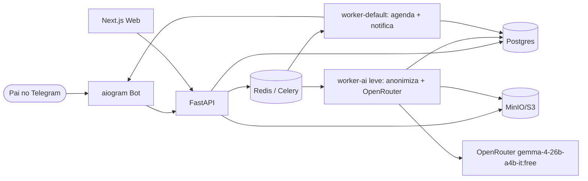
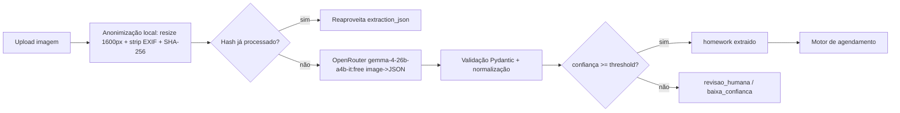

# SPECS — Hora da Tarefa (SDD)

> Documento de Especificação Técnica (Spec-Driven Development).
> Autor: subagente SPEC + OpenCode · Versão: 1.1 (OpenRouter) · Status: **Rascunho para revisão**
> Escopo: MVP em VPS única (1 vCPU, 4 GB RAM, 50 GB disco) com Docker Compose + IA via OpenRouter (`google/gemma-4-26b-a4b-it:free`).
> Autoridade: esta spec define o comportamento esperado. Código que altere comportamento sem atualização desta spec no mesmo commit é inválido.

---

## Sumário

0. [Visão Técnica e Stack](#0-visão-técnica-e-stack)
1. [Arquitetura de Componentes](#1-arquitetura-de-componentes)
2. [Modelo de Dados](#2-modelo-de-dados)
3. [Contratos de API REST](#3-contratos-de-api-rest)
4. [Motor de Agendamento](#4-motor-de-agendamento)
5. [Pipeline de IA](#5-pipeline-de-ia)
6. [Bot Telegram](#6-bot-telegram)
7. [Telas para geração via Stitch (MCP)](#7-telas-para-geração-via-stitch-mcp)
8. [Design System inicial para `stitch_create_design_system`](#8-design-system-inicial-para-stitch_create_design_system)
9. [Critérios de Aceitação, Plano de Testes e Observabilidade](#9-critérios-de-aceitação-plano-de-testes-e-observabilidade)
10. [Segurança e LGPD](#10-segurança-e-lgpd)
11. [Requisitos Não-Funcionais (RNF)](#11-requisitos-não-funcionais-rnf)
12. [Rastreabilidade RF/RNF → Spec](#12-rastreabilidade-rfrnf--spec)
13. [Requisitos Funcionais (índice)](#13-requisitos-funcionais-índice)
14. [Open Questions](#14-open-questions)

---

## 0. Visão Técnica e Stack

### 0.1 Princípios de projeto

| Princípio | Decisão |
|---|---|
| Baixo consumo | IA 100% via API externa gratuita; zero inferência local. Sem dependência de GPU/VLM quantizado no MVP. |
| Simplicidade operacional | Um único `docker-compose.yml`; sem Kubernetes; sem Redis cluster; sem Ollama/llama.cpp. |
| Degradação graciosa | Se IA falhar/baixa confiança → tarefa vai para fila de **revisão humana** no app (nunca perde o upload). |
| Offline-first do bot | Toda notificação é idempotente e persistida em `notification_log`; reenvio seguro. |
| Testabilidade | Núcleo (agendamento, extração → JSON, status FSM) são funções puras testáveis sem VLM/rede. |

### 0.2 Stack sugerida

| Camada | Escolha primária | Alternativa | Justificativa |
|---|---|---|---|
| Frontend | **Next.js 14 (App Router) + React + TypeScript + Tailwind CSS + shadcn/ui** | Vite + React | Export estático serve à VPS; Tailwind/shadcn casam com telas geradas no Stitch (tokens viram CSS vars). |
| Backend | **Python 3.11 + FastAPI + Pydantic v2 + SQLAlchemy 2 + Alembic** | Node/NestJS | FastAPI integra direto com stack de IA em Python (OCR/VLM) e valida contratos com Pydantic. |
| Banco | **PostgreSQL 16** | — | JSONB para payloads IA, `tsrange`/`tstzrange` para slots, forte em constraints. |
| Fila/Jobs | **Celery + Redis (broker + result backend)** | BullMQ (se backend Node) · cron simples como fase 0 | Celery permite workers GPU/CPU dedicados, retries e prioridade; Redis 7 leve. |
| Storage | **MinIO (S3-compatible) em volume Docker** | diretório em volume + abstração S3 | Mesma API S3 permite migrar para provedor externo sem trocar código. |
| Bot Telegram | **aiogram 3 (Python)** | grammY/Telegraf (Node) | aiogram no mesmo runtime do backend; webhook + FSM + idempotência. |
| OCR | **Nenhum no caminho crítico** (Gemma 4 lê imagem direto) | Tesseract 5 como enriquecimento futuro opcional | Removido para simplificar; reavaliar pós-MVP se manuscrito exigir |
| VLM (extração) | **OpenRouter `google/gemma-4-26b-a4b-it:free` via `openai` SDK (`base_url=https://openrouter.ai/api/v1`)** | `google/gemma-4-26b-a4b-it` (pago) para SLA maior | MoE 25.2B/3.8B ativos, multimodal texto+imagem, 262k contexto, structured output, custo zero |
| LLM fallback texto | **O mesmo Gemma 4 (só-texto, sem imagem)** | — | Sem Llama/Qwen local; retry usa o mesmo modelo com `temperature=0.1` |
| Runtime IA | **HTTP client + Pillow (resize/strip EXIF)** | — | Sem Ollama/llama.cpp; worker leve |
| Reverse proxy/TLS | **Caddy** (TLS automático) | Nginx + certbot | Menos config na VPS. |
| Observabilidade | **structlog (JSON) + Prometheus/client + Grafana Cloud free (ou Loki)** | — | Logs estruturados + métricas de fila/IA/latência. |
| CI/CD | GitHub Actions → build imagens → `docker compose pull && up -d` na VPS | — | Rolling restart simples. |

### 0.3 Orçamento de recursos (1 vCPU / 4 GB / 50 GB — sem IA local)

> **Sem VLM/Ollama na VPS.** Worker de IA é só HTTP + Pillow. Gargalo passa a ser rate limit do tier free, não RAM.

| Serviço | RAM alvo (limit) | CPU | Observação |
|---|---|---|---|
| caddy | 64 MB | 0.1 | proxy |
| api (FastAPI, inclui cliente OpenRouter) | 384 MB | 0.5 | |
| worker-default (notificações, agendamento) | 256 MB | 0.3 | |
| worker-ai (anonimiza + chama OpenRouter) | 256 MB | 0.3 | **concurrency=3–5**, jobs I/O-bound; sem modelo residente |
| postgres | 512 MB | 0.3 | `shared_buffers=128MB` |
| redis | 128 MB | 0.1 | `maxmemory 96mb`, `noeviction` — fila IA + backoff + cache sha256 |
| minio | 256 MB | 0.2 | |
| **Total simultâneo (pico)** | **≈1.9 GB** | ~1.6 vCPU | folga confortável em 4 GB; sem swap/OOM de IA. |

**Mitigações de rate limit (tier free):** backoff exponencial 1/5/30 min (3 retries), cache/dedupe por `sha256` (nunca reprocessa mesma foto), `AI_WORKER_CONCURRENCY` configurável, upgrade para `google/gemma-4-26b-a4b-it` pago só trocando `OPENROUTER_MODEL`.

### 0.4 Estrutura de repositório sugerida

```
hora_da_tarefa/
├─ docker-compose.yml
├─ .env.example
├─ Caddyfile
├─ frontend/            # Next.js
├─ backend/
│  ├─ app/
│  │  ├─ api/           # routers FastAPI
│  │  ├─ core/          # config, security, logging (inclui settings OpenRouter)
│  │  ├─ models/        # SQLAlchemy
│  │  ├─ schemas/       # Pydantic (inclui ExtractionResult)
│  │  ├─ services/      # scheduling.py, vision_openrouter.py, notify.py
│  │  ├─ tasks/         # celery tasks (extract_homework via OpenRouter)
│  │  └─ bot/           # aiogram handlers
│  ├─ alembic/
│  └─ tests/            # test_vision_openrouter.py (mock + live opcional)
├─ ai/                  # prompts/gemma_system.txt (sem Docker de VLM, sem .gguf)
└─ specs/               # specs individuais
```

---

## 1. Arquitetura de Componentes

### 1.1 Diagrama (fluxo)



### 1.2 Componentes e responsabilidades

| Componente | Responsabilidade | Não faz |
|---|---|---|
| `api` | Autenticação, CRUD, upload, upload→fila, expõe `/suggestions`, webhook Telegram | Não chama IA inline (só enfileira) |
| `worker-ai` | Anonimiza imagem (resize/strip EXIF/hash), chama OpenRouter Gemma 4, valida JSON, grava `homework` + `homework_image` | Não roda modelo local; não envia notificação |
| `worker-default` | Recalcula sugestões, dispara notificações 24h/2h, transições de status por tempo (atrasada) | Não processa imagem |
| `scheduler` (beat) | Aciona periodicamente: varredura de prazos, recalcular agenda, retry de jobs | - |
| `bot` (aiogram) | Recebe update do Telegram, valida usuário, chama API interna | Não acessa DB diretamente (usa API) |
| `minio` | Guarda imagens originais e derivadas | - |
| `openrouter` (externo) | Inferência multimodal imagem→JSON (`google/gemma-4-26b-a4b-it:free`) | Não guarda estado; rate limited no free |

### 1.3 Fluxo principal (happy path)

1. Pai envia foto no Telegram → bot baixa arquivo e chama `POST /homeworks/upload` (multipart) com `child_id` opcional.
2. API anonimiza (resize ≤1600px, strip EXIF, SHA-256), grava `homework` (status `pendente`), salva imagem em `homework_image`, publica job `extract_homework` na fila `ai` (dedupe por `sha256`: hash repetido reaproveita `extraction_json` sem chamar API).
3. `worker-ai` chama OpenRouter `google/gemma-4-26b-a4b-it:free` (imagem base64 + prompt) → JSON validado → atualiza `homework` (matéria, enunciado, due_at, confiança) → publica `compute_suggestions`.
4. `worker-default` roda motor de agendamento → grava `suggestion_slot` → publica `notify` (sugestão inicial).
5. Bot envia mensagem com sugestão e botões (`Agendar` / `Outra` / `Não é tarefa`).
6. Beat agenda lembretes 24h/2h em `notification_log` (status `scheduled`) e dispara quando vence.

---

## 2. Modelo de Dados

### 2.1 Convenções

- PKs: `uuid` (v7 preferencial) ou `bigserial`; adotado **UUID v4** para entidades sincronizáveis.
- Todas as tabelas: `created_at`, `updated_at` (`timestamptz`), soft delete via `deleted_at` onde indicado.
- Fuso: armazenar `timestamptz` (UTC); timezone do usuário em `user.timezone` (default `America/Sao_Paulo`).
- Enums nativos do Postgres.
- Dados de menor: ver §10 (LGPD) — nenhum dado sensível do menor além do necessário.
- **Persistência ativa (F0, 2026-09-22):** stores in-memory removidos; `app/tasks/*` operam via SQLAlchemy (`app/core/db.py`, sessão curta por operação, retorno em dicts) sobre **Postgres 16** (prod/compose) ou **sqlite** (dev/testes via `DATABASE_URL`). Alembic `0001` (tabelas §2) + `0002` (`notification_settings`: toggles 24h/2h + quiet por criança). Imagens via `StorageProvider` (`app/core/storage.py`: `local` em dev/testes, `s3`/MinIO no compose com `STORAGE_BACKEND=s3`); `homework_image` persiste metadados + `expires_at` (retenção RNF-09/11 via `purge_expired_images`).

### 2.2 Enums

```sql
CREATE TYPE homework_status AS ENUM
  ('pendente','agendada','em_andamento','concluida','atrasada','cancelada','nao_realizada','arquivada');

CREATE TYPE extraction_status AS ENUM ('pendente','processando','ok','baixa_confianca','falhou','revisao_humana');

CREATE TYPE notification_kind AS ENUM ('sugestao_inicial','lembrete_24h','lembrete_2h','atraso','resumo_diario');

CREATE TYPE notification_status AS ENUM ('scheduled','sent','failed','cancelled','skipped');
```

### 2.3 `user` (responsável/guardião — conta de login)

| Coluna | Tipo | Restrições | Descrição |
|---|---|---|---|
| id | uuid | PK | |
| email | text | UNIQUE, NOT NULL | login web |
| password_hash | text | NULL | null se login só Telegram |
| name | text | NOT NULL | |
| timezone | text | NOT NULL default 'America/Sao_Paulo' | |
| locale | text | NOT NULL default 'pt-BR' | |
| telegram_user_id | bigint | UNIQUE, NULL | vínculo bot |
| telegram_link_code | text | NULL | código efêmero p/ vincular |
| lgpd_consent_at | timestamptz | NULL | consentimento |
| lgpd_consent_version | text | NULL | versão do termo |
| retention_image_days | int | NOT NULL default 90 | política de retenção |
| created_at / updated_at | timestamptz | NOT NULL | |
| deleted_at | timestamptz | NULL | soft delete |

### 2.4 `guardian` (vínculo usuário↔criança; permite 2 responsáveis)

| Coluna | Tipo | Restrições |
|---|---|---|
| id | uuid | PK |
| user_id | uuid | FK user(id) ON DELETE CASCADE |
| child_id | uuid | FK child(id) ON DELETE CASCADE |
| relationship | text | 'pai','mae','responsavel' |
| is_primary | bool | default false |
| can_receive_notifications | bool | default true |
| | | UNIQUE(user_id, child_id) |

### 2.5 `child`

| Coluna | Tipo | Restrições | Descrição |
|---|---|---|---|
| id | uuid | PK | |
| name | text | NOT NULL | nome/apelido |
| birth_date | date | NULL | idade p/ calibrar duração |
| grade_level | text | NULL | ex.: "6º ano" |
| school_name | text | NULL | |
| timezone | text | NOT NULL default 'America/Sao_Paulo' | |
| active | bool | default true | |
| created_at / updated_at | timestamptz | NOT NULL | |
| deleted_at | timestamptz | NULL | |

> Não há PII além de nome/data; nenhuma credencial do menor. `child` pertence ao `user` via `guardian`.

### 2.6 `school_schedule` (grade semanal recorrente)

| Coluna | Tipo | Restrições | Descrição |
|---|---|---|---|
| id | uuid | PK | |
| child_id | uuid | FK child(id) ON DELETE CASCADE | |
| weekday | smallint | 0–6 (0=domingo), NOT NULL | |
| start_time | time | NOT NULL | hora local |
| end_time | time | NOT NULL | |
| subject | text | NOT NULL | matéria |
| kind | text | 'aula','intervalo','outro' | default 'aula' |
| valid_from | date | NULL | vigência |
| valid_to | date | NULL | |
| created_at / updated_at | timestamptz | NOT NULL | |

CHECK (`end_time` > `start_time`). UNIQUE(child_id, weekday, start_time, subject).

### 2.7 `activity` (atividades extra — recorrência)

| Coluna | Tipo | Restrições | Descrição |
|---|---|---|---|
| id | uuid | PK | |
| child_id | uuid | FK child(id) ON DELETE CASCADE | |
| title | text | NOT NULL | ex.: "Natação" |
| weekday | smallint | NULL 0–6 | null se data única |
| start_time | time | NOT NULL | |
| end_time | time | NOT NULL | |
| recurrence | text | 'weekly','once','biweekly' | default 'weekly' |
| event_date | date | NULL | se recurrence='once' |
| location | text | NULL | |
| travel_before_min | int | default 0 | deslocamento ida |
| travel_after_min | int | default 0 | deslocamento volta |
| is_blocking | bool | default true | bloqueia slot |
| created_at / updated_at | timestamptz | NOT NULL | |

### 2.8 `homework`

| Coluna | Tipo | Restrições | Descrição |
|---|---|---|---|
| id | uuid | PK | |
| child_id | uuid | FK child(id) ON DELETE CASCADE | |
| created_by_user_id | uuid | FK user(id) SET NULL | quem cadastrou |
| subject | text | NULL | preenchida pela IA/edição |
| title | text | NULL | resumo curto |
| statement | text | NULL | enunciado |
| due_at | timestamptz | NULL | data de entrega |
| estimated_minutes | int | NULL | duração estimada |
| priority | smallint | default 1 | 0=baixa,1=normal,2=alta |
| status | homework_status | NOT NULL default 'pendente' | FSM §4.6 |
| extraction_status | extraction_status | NOT NULL default 'pendente' | |
| extraction_confidence | numeric(4,3) | NULL 0–1 | confiança global |
| extraction_json | jsonb | NULL | saída bruta/validada da IA |
| source | text | 'telegram','web','api' | |
| scheduled_start | timestamptz | NULL | slot escolhido |
| scheduled_end | timestamptz | NULL | |
| completed_at | timestamptz | NULL | |
| archived_at | timestamptz | NULL | |
| created_at / updated_at | timestamptz | NOT NULL | |
| deleted_at | timestamptz | NULL | |

Índices: `(child_id, status)`, `(child_id, due_at)`, GIN em `extraction_json`.

### 2.9 `homework_image`

| Coluna | Tipo | Restrições | Descrição |
|---|---|---|---|
| id | uuid | PK | |
| homework_id | uuid | FK homework(id) ON DELETE CASCADE | |
| storage_key | text | NOT NULL | chave no S3/MinIO |
| mime_type | text | NOT NULL | |
| size_bytes | bigint | NOT NULL | |
| width / height | int | NULL | |
| sha256 | text | NOT NULL | dedupe |
| ocr_text | text | NULL | texto OCR — **não usado no MVP OpenRouter** (reservado p/ enriquecimento futuro) |
| preprocessed_key | text | NULL | imagem anonimizada (1600px, sem EXIF, JPEG) |
| created_at | timestamptz | NOT NULL | |
| expires_at | timestamptz | NULL | retenção (§10) |

Índice UNIQUE `(homework_id, sha256)`.

### 2.10 `suggestion_slot`

| Coluna | Tipo | Restrições | Descrição |
|---|---|---|---|
| id | uuid | PK | |
| homework_id | uuid | FK homework(id) ON DELETE CASCADE | |
| child_id | uuid | FK child(id) ON DELETE CASCADE | |
| rank | smallint | NOT NULL | 1 = melhor |
| start_at | timestamptz | NOT NULL | |
| end_at | timestamptz | NOT NULL | |
| score | numeric(6,3) | NOT NULL | maior=melhor |
| reason | text | NULL | explicação legível |
| accepted | bool | NULL | null=pendente, true/false decisão |
| created_at | timestamptz | NOT NULL | |
| | | UNIQUE(homework_id, rank) | |

### 2.11 `notification_log`

| Coluna | Tipo | Restrições | Descrição |
|---|---|---|---|
| id | uuid | PK | |
| user_id | uuid | FK user(id) ON DELETE CASCADE | destinatário |
| child_id | uuid | FK child(id) ON DELETE SET NULL | |
| homework_id | uuid | FK homework(id) ON DELETE CASCADE | |
| kind | notification_kind | NOT NULL | |
| scheduled_for | timestamptz | NOT NULL | quando deve sair |
| sent_at | timestamptz | NULL | |
| status | notification_status | NOT NULL default 'scheduled' | |
| telegram_message_id | bigint | NULL | |
| idempotency_key | text | UNIQUE, NOT NULL | `{kind}:{homework_id}:{user_id}` |
| payload | jsonb | NULL | render |
| error | text | NULL | |
| attempts | smallint | default 0 | |
| created_at / updated_at | timestamptz | NOT NULL | |

### 2.12 Relacionamentos (resumo)

```
user 1─* guardian *─1 child
child 1─* school_schedule
child 1─* activity
child 1─* homework
homework 1─* homework_image
homework 1─* suggestion_slot
homework 1─* notification_log
user 1─* notification_log
```

### 2.13 Prisma-style (textual, para referência de implementação)

> O backend é Python/SQLAlchemy, mas abaixo o schema em sintaxe Prisma caso o frontend/equipe prefira gerar tipos; **fonte de verdade é o SQL/Alembic**.

```prisma
model User {
  id                 String    @id @default(uuid())
  email              String    @unique
  passwordHash       String?
  name               String
  timezone           String    @default("America/Sao_Paulo")
  locale             String    @default("pt-BR")
  telegramUserId     BigInt?   @unique
  telegramLinkCode   String?
  lgpdConsentAt      DateTime?
  lgpdConsentVersion String?
  retentionImageDays Int       @default(90)
  guardians          Guardian[]
  createdAt          DateTime  @default(now())
  updatedAt          DateTime  @updatedAt
}

model Child {
  id             String   @id @default(uuid())
  name           String
  birthDate      DateTime?
  gradeLevel     String?
  schoolName     String?
  timezone       String   @default("America/Sao_Paulo")
  active         Boolean  @default(true)
  guardians      Guardian[]
  schedules      SchoolSchedule[]
  activities     Activity[]
  homeworks      Homework[]
}

model Homework {
  id                   String        @id @default(uuid())
  childId              String
  subject              String?
  title                String?
  statement            String?
  dueAt                DateTime?
  estimatedMinutes     Int?
  priority             Int           @default(1)
  status               String        @default("pendente")
  extractionStatus     String        @default("pendente")
  extractionConfidence Float?
  extractionJson       Json?
  scheduledStart       DateTime?
  scheduledEnd         DateTime?
  child                Child         @relation(fields: [childId], references: [id])
  images               HomeworkImage[]
  suggestions          SuggestionSlot[]
}
```

---

## 3. Contratos de API REST

### 3.1 Convenções

- Base: `https://api.horadatarefa.app/v1`
- Auth: Bearer JWT (frontend) **ou** header interno `X-Bot-Token` (bot→API).
- Datas: ISO-8601 com offset. IDs: UUID.
- Erros no padrão:

```json
{ "error": { "code": "HOMEWORK_NOT_FOUND", "message": "Tarefa não encontrada.", "details": {} } }
```

| HTTP | code | Quando |
|---|---|---|
| 400 | `VALIDATION_ERROR` | payload inválido (Pydantic) |
| 401 | `UNAUTHORIZED` | token ausente/inválido |
| 403 | `FORBIDDEN` | não é dono do recurso (IDOR) |
| 404 | `*_NOT_FOUND` | recurso inexistente |
| 409 | `STATUS_CONFLICT` | transição de status inválida |
| 413 | `FILE_TOO_LARGE` | upload > limite |
| 415 | `UNSUPPORTED_MEDIA_TYPE` | mime fora da allowlist |
| 422 | `EXTRACTION_LOW_CONFIDENCE` | IA abaixo do threshold (não bloqueia, sinaliza) |
| 429 | `RATE_LIMITED` | excedeu limite |
| 500 | `INTERNAL_ERROR` | |
| 503 | `AI_UNAVAILABLE` | worker IA saturado/indisponível |

### 3.2 `POST /homeworks/upload`

Upload de foto da tarefa. `multipart/form-data`.

**Request**
| Campo | Tipo | Obrigatório | Regras |
|---|---|---|---|
| file | file | sim | image/jpeg, image/png, image/webp; ≤ 10 MB; ≤ 6000px lado |
| child_id | uuid | sim (ou detectado) | deve pertencer ao usuário |
| source | enum | não | default `web` |
| hint_text | string | não | texto do pai ("é de matemática") |

**Response 202**
```json
{
  "homework_id": "3f1c...",
  "child_id": "a91b...",
  "status": "pendente",
  "extraction_status": "processando",
  "message": "Tarefa recebida. Processamento iniciado."
}
```

**Erros:** 400, 403 (child de outro usuário), 413, 415, 429.

### 3.3 `GET /homeworks`

Lista paginada e filtrada.

**Query params:** `child_id`, `status` (CSV), `subject`, `due_before`, `due_after`, `q` (busca em title/statement), `page` (default 1), `page_size` (default 20, max 100), `sort` (`due_at|-due_at|created_at`).

**Response 200**
```json
{
  "items": [
    {
      "id": "3f1c...",
      "child_id": "a91b...",
      "subject": "Matemática",
      "title": "Lista de frações",
      "due_at": "2026-09-25T23:59:00-03:00",
      "status": "agendada",
      "extraction_status": "ok",
      "extraction_confidence": 0.91,
      "scheduled_start": "2026-09-23T16:00:00-03:00",
      "estimated_minutes": 40,
      "priority": 1,
      "created_at": "2026-09-22T10:00:00-03:00"
    }
  ],
  "page": 1,
  "page_size": 20,
  "total": 137
}
```

### 3.4 `GET /homeworks/:id`

**Response 200** — objeto completo incluindo `statement`, `extraction_json`, `images[]` (URLs assinadas 15 min) e `suggestions[]`.

```json
{
  "id": "3f1c...",
  "child_id": "a91b...",
  "subject": "Matemática",
  "title": "Lista de frações",
  "statement": "Resolver os exercícios 1 a 10 da página 42.",
  "due_at": "2026-09-25T23:59:00-03:00",
  "status": "agendada",
  "extraction_status": "ok",
  "extraction_confidence": 0.91,
  "estimated_minutes": 40,
  "images": [{ "id": "img1", "url": "https://minio/...sig", "expires_at": "..." }],
  "suggestions": [
    { "id": "sg1", "rank": 1, "start_at": "2026-09-23T16:00:00-03:00", "end_at": "2026-09-23T16:40:00-03:00", "score": 87.5, "reason": "Livre após a escola; entrega em 3 dias", "accepted": null }
  ]
}
```

### 3.5 `PATCH /homeworks/:id/status`

Transição de status validada pela FSM (§4.6).

**Request**
```json
{ "status": "em_andamento", "reason": null }
```

**Response 200**
```json
{ "id": "3f1c...", "status": "em_andamento", "updated_at": "2026-09-23T16:05:00-03:00" }
```

**Erros:** 404, 409 `STATUS_CONFLICT` (ex.: `concluida`→`pendente` sem `nao_realizada`), 400.

### 3.6 `POST /children/:id/schedules`

Cria/atualiza grade escolar (aceita lote).

**Request**
```json
{
  "replace": true,
  "entries": [
    { "weekday": 1, "start_time": "07:30", "end_time": "08:20", "subject": "Matemática", "kind": "aula" },
    { "weekday": 1, "start_time": "08:20", "end_time": "09:10", "subject": "Português", "kind": "aula" }
  ]
}
```

**Response 201**
```json
{ "child_id": "a91b...", "created": 12, "replaced": true }
```

### 3.7 `POST /children/:id/activities`

Cria atividade extra.

**Request**
```json
{ "title": "Natação", "weekday": 3, "start_time": "17:00", "end_time": "18:00", "recurrence": "weekly", "travel_before_min": 20, "is_blocking": true }
```

**Response 201** `{ "id": "act1", ... }`

### 3.8 `GET /suggestions`

Retorna slots sugeridos (por criança ou tarefa).

**Query:** `homework_id` **ou** `child_id` (um obrigatório), `limit` (default 5), `from`, `to`.

**Response 200**
```json
{
  "homework_id": "3f1c...",
  "generated_at": "2026-09-22T10:01:00-03:00",
  "suggestions": [
    { "rank": 1, "start_at": "2026-09-23T16:00:00-03:00", "end_at": "2026-09-23T16:40:00-03:00", "score": 87.5, "reason": "Livre após a escola; entrega em 3 dias" },
    { "rank": 2, "start_at": "2026-09-23T19:00:00-03:00", "end_at": "2026-09-23T19:40:00-03:00", "score": 71.0, "reason": "Após jantar; atenção menor" }
  ]
}
```

### 3.9 `POST /suggestions/:id/accept`

**Request** `{ "start_at": "2026-09-23T16:00:00-03:00" }` (opcional; default = slot sugerido)
**Response 200** `{ "homework_id": "3f1c...", "status": "agendada", "scheduled_start": "..." }`

### 3.10 `POST /telegram/webhook`

Recebe updates do Telegram (aiogram em modo webhook). Autenticidade via header secreto `X-Telegram-Bot-Api-Secret-Token` validado contra `TELEGRAM_WEBHOOK_SECRET`.

**Request** — Update do Telegram (resumido)
```json
{ "update_id": 99123, "message": { "message_id": 55, "from": { "id": 123456 }, "chat": { "id": 123456 }, "text": "/tarefas" } }
```

**Response 200** `{"ok": true}` — sempre 200 exceto assinatura inválida (401) e rate limit (429).

Idempotência: dedupe por `update_id` em tabela/redis (TTL 24h); updates repetidos são ignorados.

### 3.11 Endpoints auxiliares (previstos)

| Método | Rota | Descrição |
|---|---|---|
| POST | `/auth/telegram/link` | Gera `telegram_link_code` (6 dígitos, single-use) para vincular conta — `{name}` cria usuário (201) ou `{user_id}` regenera código (200); consumo no chat vincula `telegram_user_id` (gate §6.1) |
| GET | `/children` | Lista crianças do usuário |
| POST | `/children` | Cria criança |
| GET | `/children/:id/agenda` | Grade + atividades + slots ocupados |
| POST | `/notifications/settings` | Preferências (24h/2h on/off, quiet hours) |
| GET | `/notifications` | Histórico de notificações |
| POST | `/homeworks/:id/reprocess` | Reenfileira extração IA |

---

## 4. Motor de Agendamento

### 4.1 Objetivo

Dado uma tarefa com `due_at` e `estimated_minutes`, encontrar os **melhores slots livres** na agenda da criança, respeitando grade escolar, atividades extras, deslocamento, quiet hours e prioridade.

### 4.2 Inputs

```json
{
  "homework": { "due_at": "...", "estimated_minutes": 40, "priority": 1, "subject": "Matemática" },
  "child": { "timezone": "America/Sao_Paulo", "birth_date": "2014-03-01" },
  "schedules": [ { "weekday": 1, "start_time": "07:30", "end_time": "12:00", "kind": "aula" } ],
  "activities": [ { "weekday": 3, "start_time": "17:00", "end_time": "18:00", "travel_before_min": 20, "is_blocking": true } ],
  "preferences": {
    "study_window": { "weekday": { "start": "14:00", "end": "21:00" }, "weekend": { "start": "09:00", "end": "20:00" } },
    "quiet_hours": { "start": "21:30", "end": "07:00" },
    "min_slot_minutes": 20,
    "buffer_minutes": 10,
    "max_slots_per_day": 3
  },
  "now": "2026-09-22T10:00:00-03:00"
}
```

### 4.3 Parâmetros e defaults

| Parâmetro | Default | Uso |
|---|---|---|
| `grid_minutes` | 15 | granularidade da grade |
| `min_slot_minutes` | 20 | menor slot aceitável |
| `buffer_minutes` | 10 | intervalo entre blocos |
| `max_slots_per_day` | 3 | evita sobrecarga |
| `horizon_days` | até `due_at` (máx 14) | janela de busca |
| `study_window` | semana 14–21h / fds 9–20h | janela de estudo |
| `quiet_hours` | 21:30–07:00 | nunca agendar |

### 4.4 Algoritmo (pseudocódigo)

```
function suggest_slots(input) -> list[Slot]:
    tz = input.child.timezone
    now = input.now
    due = input.homework.due_at or now + 7d
    duration = round_up(input.homework.estimated_minutes, grid_minutes) + buffer_minutes
    earliest = max(now + MIN_LEAD_MINUTES, next_study_window_start(now))

    # 1. Gerar intervalos ocupados (bloqueios)
    busy = []
    for each weekday in range(earliest .. due):
        for s in schedules where s.weekday == weekday:
            busy.add(to_interval(s.start_time, s.end_time, date, tz))
        for a in activities matching weekday (respect recurrence):
            busy.add(to_interval(a.start_time - a.travel_before_min,
                                 a.end_time + a.travel_after_min, date, tz))
    busy = merge_overlapping(busy)

    # 2. Enumerar slots candidatos dentro da study_window e antes do due
    candidates = []
    for each day in range(earliest.date .. due.date):
        window = study_window_for(day)            # fim = min(window.end, due, quiet_start)
        for slot_start in step(day + window.start, grid_minutes, until window.end - duration):
            slot = [slot_start, slot_start + duration]
            if overlaps(slot, busy) or overlaps(slot, quiet_hours): continue
            candidates.add(slot)

    # 3. Pontuar
    for slot in candidates:
        slot.score = score(slot, input, busy)

    # 4. Diversificar por dia e ranquear
    ranked = candidates.sort_by(score desc)
    ranked = limit_max_per_day(ranked, max_slots_per_day)
    return top_n(ranked, N=5)


function score(slot, input, busy) -> float:
    s = 0
    # (a) folga em relação ao prazo: mais cedo = melhor
    days_until_due = days(slot.start, input.homework.due_at)
    s += 30 * clamp(1 - days_remaining_after(slot)/horizon, 0, 1)
    # (b) aderência ao horário de melhor foco (14–18h)
    s += 20 * focus_factor(slot.start)
    # (c) fragmentação: penaliza slot colado a compromissos (buffer respeitado conta)
    s += 10 * adjacency_factor(slot, busy)
    # (d) prioridade da tarefa (alta antecipa)
    s += 15 * (input.homework.priority / 2)
    # (e) antecedência mínima: penaliza agendar para hoje se tarefa longa
    if same_day(slot.start, now) and duration > 45: s -= 15
    # (f) matéria: evita cansaço (ex.: não 2ª língua logo após aula da mesma)
    s += subject_affinity(slot, input)
    # (g) não colidir com outras tarefas já agendadas (busy inclui)
    return clamp(s, 0, 100)
```

### 4.5 Exemplo concreto

**Entrada:** Matemática, 40 min, `due_at` = 25/09 23:59, `priority`=2 (alta), now = 22/09 10:00. Grade: seg–sex 07:30–12:00 aula; Natação qua 17:00–18:00 (travel_before 20). Study window 14–21h.

**Cálculo:** duration = ceil(40/15)*15 + 10 = 45+10 = 55 min.

| Rank | Slot | Score | Motivo |
|---|---|---|---|
| 1 | Ter 22/09 14:00–14:55 | 88 | Livre, cedo, alta prioridade, período de foco |
| 2 | Ter 22/09 16:00–16:55 | 79 | Livre, foco |
| 3 | Qua 23/09 14:00–14:55 | 74 | Antes da natação (buffer ok) |
| 4 | Qui 24/09 14:00–14:55 | 61 | Mais perto do prazo |
| 5 | Qui 24/09 19:00–19:55 | 55 | Fim de janela, atenção menor |

Qua 17:00–18:00 é bloqueado; 16:30–17:00 não cabe (travel). Sáb/dom antes do prazo também entram.

### 4.6 FSM de status

```
pendente      --agendar-->        agendada
pendente      --iniciar-->        em_andamento      (aceito)
agendada      --iniciar-->        em_andamento
agendada      --cancelar-->       cancelada
em_andamento  --concluir-->       concluida
em_andamento  --nao_realizada-->  nao_realizada
pendente|agendada --passou due_at--> atrasada      (automático, beat)
atrasada      --concluir-->       concluida
atrasada      --nao_realizada-->  nao_realizada
qualquer      --arquivar-->       arquivada        (após concluida/nao_realizada/cancelada)
```

Transições fora da matriz → `409 STATUS_CONFLICT`. Transição para `atrasada` é feita por job agendado; não sobrescreve `concluida`.

### 4.7 Estimativa de duração (heurística inicial)

| Matéria/série | Base (min) | Ajuste |
|---|---|---|
| Matemática | 40 | +10 se fund. I |
| Português/Redação | 35 | +20 se "redação" |
| Ciências/Bio/Fís/Quí | 30 | |
| História/Geografia | 30 | |
| Leitura | 25 | |
| Trabalho/projeto | 60 | +30 se "apresentação" |
| default | 30 | |

Ajuste por idade: `×1.3` se <9 anos, `×1.15` se 9–11, `×1.0` se 12+. Persistir em `estimated_minutes`.

---

## 5. Pipeline de IA (OpenRouter — sem IA local)

### 5.1 Visão geral



> Substituição total: sem PaddleOCR/Tesseract, sem Ollama/llama.cpp, sem Moondream/Qwen/Llama local no caminho crítico.

### 5.2 Etapas

**E1. Anonimização local** (`worker-ai`, Pillow, sem IA)
- Validação: mime na allowlist (`image/jpeg|png|webp`) por **magic bytes**, decodifica, rejeita corrompido.
- Auto-orientação EXIF + **remoção total de EXIF** (privacidade LGPD).
- Redimensiona para máx. lado **1600px** (economia de tokens/latência), converte para **JPEG q=82**, calcula **SHA-256** para dedupe/cache.
- Salva original + derivada em `homework_image` (`storage_key`, `preprocessed_key`, `expires_at` 90 dias).
- Hash repetido → reaproveita `extraction_json` anterior, **não chama API**.
- **Timeout:** 10 s nesta etapa.

**E2. Chamada OpenRouter** — `google/gemma-4-26b-a4b-it:free`
- `POST https://openrouter.ai/api/v1/chat/completions`, SDK `openai` Python com `base_url="https://openrouter.ai/api/v1"`, `api_key=$OPENROUTER_API_KEY`.
- Payload: `model="google/gemma-4-26b-a4b-it:free"`, `messages=[{role:"user", content:[{type:"text", text:SYSTEM+hint},{type:"image_url", image_url:{url:"data:image/jpeg;base64,..."}}]}]`, `response_format={"type":"json_object"}`, `temperature=0.1`, `max_tokens=2048`.
- Headers: `Authorization: Bearer …`, `HTTP-Referer: $OPENROUTER_SITE_URL`, `X-Title: $OPENROUTER_APP_NAME`.
- Decodificação forçada de JSON (parse + retry único em modo só-texto com o mesmo modelo se 1ª resposta vier com markdown).
- **Timeout:** 60 s + retry 1× imediato; 429/5xx → backoff Celery 1/5/30 min (máx. 3 tentativas).

**E3. Validação** (Pydantic `ExtractionResult`)
- `subject` deve estar em taxonomia conhecida; senão `"Outro"`.
- `due_at`: parser de datas pt-BR ("sexta", "25/09", "amanhã"); se só dia → 23:59 local; se passado → próximo ciclo válido.
- `statement` máx 4000 chars; trunca e marca `needs_review=true`.
- `confidence` vem do modelo (0–1); `needs_review` = `confidence<0.75` ou críticos nulos.
- `is_homework=false` com conf ≥0.8 → descarta com aviso.

**E4. Persistência e evento** — grava `homework.extraction_json` (+ `meta.engine="google/gemma-4-26b-a4b-it:free"`, `tokens`, `latency_ms`, `image_sha256`), `extraction_status`, publica `compute_suggestions`.

**E5. Falha/rate limit** — se 3 retries falharem (429 persistente, timeout, OOM remoto) → `extraction_status='falhou'` + orienta entrada manual. `AI_ENABLED=false` desliga IA e opera só manual. Sem fallback local no MVP.

### 5.3 System prompt (Gemma 4 multimodal — imagem + texto)

```
Você é um assistente que lê fotografias de tarefas escolares brasileiras
e extrai informação estruturada. Responda APENAS com um objeto JSON válido,
sem texto extra, sem markdown.

Regras:
- "subject" deve ser uma destas matérias: Matemática, Português, Redação,
  Ciências, Biologia, Física, Química, História, Geografia, Inglês, Espanhol,
  Artes, Educação Física, Ensino Religioso, Outro.
- "due_at": data de entrega no formato YYYY-MM-DD. Se aparecer "sexta",
  calcule a próxima sexta a partir da data de hoje (America/Sao_Paulo). Se não houver data clara, use null.
- "title": resumo de até 8 palavras.
- "statement": enunciado transcrito fielmente da imagem, sem inventar.
- "estimated_minutes": inteiro; estime pela quantidade de exercícios.
- "priority": 0=baixa, 1=normal, 2=alta (prova/trabalho = 2).
- "confidence": 0.0 a 1.0, sua certeza geral.
- "needs_review": true se qualquer campo crítico incerto.
- Se a imagem não for uma tarefa escolar, retorne {"is_homework": false, "confidence": 0.9, "needs_review": true}.

Esquema:
{
  "is_homework": true,
  "subject": "string",
  "title": "string",
  "statement": "string",
  "due_at": "YYYY-MM-DD|null",
  "estimated_minutes": integer|null,
  "priority": 0|1|2,
  "confidence": number,
  "needs_review": boolean
}
```

Exemplo de chamada (OpenAI SDK):
```python
from openai import OpenAI
client = OpenAI(base_url="https://openrouter.ai/api/v1", api_key=os.environ["OPENROUTER_API_KEY"])
resp = client.chat.completions.create(
  model="google/gemma-4-26b-a4b-it:free",
  messages=[{"role": "user", "content": [
    {"type": "text", "text": SYSTEM_PROMPT + f"\nDica do responsável: {hint_text}"},
    {"type": "image_url", "image_url": {"url": f"data:image/jpeg;base64,{b64}"}},
  ]}],
  response_format={"type": "json_object"},
  temperature=0.1,
  max_tokens=2048,
  extra_headers={"HTTP-Referer": SITE_URL, "X-Title": APP_NAME},
)
```

### 5.4 Formato JSON de saída (contrato interno)

```json
{
  "is_homework": true,
  "subject": "Matemática",
  "title": "Lista de frações",
  "statement": "Resolver os exercícios 1 a 10 da página 42.",
  "due_at": "2026-09-25",
  "estimated_minutes": 40,
  "priority": 2,
  "confidence": 0.91,
  "needs_review": false,
  "meta": {
    "engine": "google/gemma-4-26b-a4b-it:free",
    "provider": "openrouter",
    "prompt_tokens": 1240,
    "completion_tokens": 180,
    "latency_ms": 3200,
    "image_sha256": "..."
  }
}
```

### 5.5 Thresholds, rate limit e fallback

| Condição | Ação |
|---|---|
| `confidence ≥ 0.75` e `is_homework=true` | `extraction_status='ok'`; sugere e notifica automático |
| `0.6 ≤ confidence < 0.75` | `extraction_status='baixa_confianca'`; notifica pedindo confirmação |
| `confidence < 0.6` ou campos críticos nulos | `revisao_humana`; bot envia formulário rápido / UI destaca |
| `is_homework=false` e conf ≥0.8 | descarta com aviso "Não identifiquei uma tarefa" |
| 429 rate limit (tier free) ou 5xx/timeout 60s | backoff Celery 1/5/30 min, máx. 3 retries; depois → `falhou` + entrada manual |
| Tarefa repetida (sha256 igual) | reaproveita extração anterior, **não chama API** |
| `AI_ENABLED=false` | pula IA, cria tarefa para preenchimento manual |

### 5.6 Config IA (`.env` — ver `.env.example`)

```
# OpenRouter (primário, substitui VLM local)
OPENROUTER_API_KEY=sk-or-v1-...
OPENROUTER_MODEL=google/gemma-4-26b-a4b-it:free
OPENROUTER_BASE_URL=https://openrouter.ai/api/v1
OPENROUTER_SITE_URL=https://horadatarefa.app
OPENROUTER_APP_NAME=Hora da Tarefa
OPENROUTER_TIMEOUT_SECONDS=60
OPENROUTER_MAX_TOKENS=2048
OPENROUTER_TEMPERATURE=0.1
# Pipeline
AI_ENABLED=true
AI_CONFIDENCE_OK=0.75
AI_CONFIDENCE_REVIEW=0.60
AI_WORKER_CONCURRENCY=3
AI_MAX_IMAGE_SIDE=1600
AI_JPEG_QUALITY=82
```

---

## 6. Bot Telegram

### 6.1 Modo de operação

- **Produção:** webhook (`POST /v1/telegram/webhook`) atrás do Caddy com TLS; `secret_token` do Telegram validado.
- **Desenvolvimento/local:** polling via `aiogram` (`RUN_MODE=polling`), útil na VPS sem domínio.
- **Idempotência:** dedupe por `update_id` (Redis SET NX, TTL 24 h); reenvio do Telegram não duplica ação.
- **Gate de acesso (obrigatório):** somente `telegram_user_id` vinculados acessam o bot. Pareamento via `POST /v1/auth/telegram/link` (gera código de 6 dígitos single-use) consumido no chat como código puro ou `/start <código>`. Sem vínculo: qualquer comando/foto/callback recebe mensagem de acesso restrito e **nada é criado nem listado** (sem vazamento de dados entre responsáveis). Tabela `app_user` (migração `0003`).
- **Bot API real (sem aiogram):** `app/bot/telegram_api.py` (httpx) — fotos baixadas via `getFile` (falha → msg de erro, nada criado; jamás sintetiza bytes); respostas descarregadas do outbox via `sendMessage` em background quando `TELEGRAM_LIVE_SEND=true` (compose). `dispatch_due(sender=)` entrega lembretes 24h/2h/atraso ao `created_by_user_id` vinculado (templates §6.3), uma única vez por `idempotency_key`.

### 6.2 Comandos e handlers

| Comando | Descrição | Resposta |
|---|---|---|
| `/start` | Boas-vindas + vínculo | Se sem vínculo, pede código de pareamento; senão mostra menu. |
| `/tarefas` | Lista tarefas ativas | Lista com status e prazo; botões inline por item. |
| `/hoje` | Agenda do dia | Slots agendados de hoje por criança. |
| `/concluir <id>` | Marca concluída | Atalho; também via botão "Concluir". |
| `/criancas` | Lista/troca criança | Define contexto ao enviar foto. |
| `/ajuda` | Ajuda | Lista comandos. |
| (foto) | Upload | Cria homework; responde com "processando". |
| callback `agendar:<suggestion_id>:<rank>` | Aceita sugestão | Confirma e agenda. |
| callback `outra:<homework_id>` | Nova sugestão | Exibe próximo rank. |
| callback `nao_tarefa:<homework_id>` | Descarta | Marca `cancelada`. |
| callback `concluir:<homework_id>` | Conclui | Atualiza status. |

### 6.3 Templates de mensagem

**Boas-vindas `/start`**
```
Olá, {{name}}! 👋 Eu sou o Hora da Tarefa.
Envie a foto da tarefa de casa e eu organizo a agenda do seu filho.

Para vincular sua conta, use o código: `{{link_code}}`
```

**Sugestão inicial (após extração)**
```
📚 Nova tarefa detectada
{{child_name}} · {{subject}}
"{{title}}"
Entrega: {{due_at | relative}}

Melhor horário livre que encontrei:
🗓 {{suggested_start | weekday, dd/MM HH:mm}} — {{duration}} min
Motivo: {{reason}}

[✅ Agendar] [🔁 Outra opção] [🚫 Não é tarefa]
```

**Lembrete 24h**
```
⏰ Falta 1 dia
{{subject}} — "{{title}}" de {{child_name}}
Entrega: {{due_at | weekday, dd/MM HH:mm}}
Agendado para: {{scheduled_start | weekday, dd/MM HH:mm}}
[✅ Concluir] [🗓 Reagendar]
```

**Lembrete 2h**
```
⚡ Em 2 horas
{{subject}} — "{{title}}" ({{child_name}})
Começa {{scheduled_start | HH:mm}}. Vai dar tempo? 💪
[✅ Concluir] [⏳ Adiar]
```

**Atraso**
```
⚠️ Tarefa atrasada
{{subject}} — "{{title}}" ({{child_name}}) passou do prazo ({{due_at}}).
[🗓 Reagendar] [✅ Concluir] [✖️ Não foi possível]
```

### 6.4 Eventos de notificação

| kind | Gatilho | Idempotency key |
|---|---|---|
| `sugestao_inicial` | extração ok/baixa | `sug:{homework_id}:{user_id}` |
| `lembrete_24h` | `scheduled_for = scheduled_start - 24h` | `r24:{homework_id}:{user_id}` |
| `lembrete_2h` | `scheduled_for = scheduled_start - 2h` | `r2:{homework_id}:{user_id}` |
| `atraso` | beat detecta `due_at < now`, status não final | `late:{homework_id}:{user_id}` |
| `resumo_diario` | opcional, 07:00 local | `daily:{user_id}:{date}` |

- Respeitar `quiet_hours`: lembretes fora da janela são adiados para o início da janela.
- `can_receive_notifications=false` no `guardian` → pula.
- Retry: 3 tentativas com backoff 1/5/30 min; falha → `failed` + log.

---

## 7. Telas para geração via Stitch (MCP)

> Cada tela abaixo traz **prompt pronto** para `stitch_generate_screen_from_text` (device: `DESKTOP`; gerar variantes `MOBILE` depois). Projeto a criar com `stitch_create_project`: **"Hora da Tarefa"**. Aplicar design system (§8) antes de gerar.

### 7.1 Dashboard (Visão Geral)

- **Layout:** header com seletor de criança + avatar; cards KPI (Pendentes, Agendadas, Atrasadas, Concluídas na semana); lista "Próximas tarefas" com prazo; painel "Hoje" com timeline de slots; botão flutuante "Enviar tarefa".
- **Componentes:** `ChildSwitcher`, `StatCard`, `UpcomingTaskList`, `TodayTimeline`, `FAB Upload`, `EmptyState`.
- **Prompt:**
```
Aplicativo web para pais gerenciarem tarefas escolares dos filhos. Gere uma tela de Dashboard em português do Brasil, tema claro, lúdico mas confiável, cores primárias azul-profundo e verde, cantos arredondados. Topo: seletor de criança com avatar e nome "Ana, 10 anos", e botão "+ Enviar tarefa". Abaixo, 4 cards de métricas: Pendentes (3), Agendadas (5), Atrasadas (1), Concluídas na semana (12). Depois, duas colunas: à esquerda "Próximas tarefas" com cards contendo matéria (colorida por matéria), título, prazo relativo e status pill; à direita "Hoje" com timeline vertical de blocos de horário (16:00 Matemática, 17:30 Aula de inglês). Sidebar de navegação à esquerda com Dashboard, Tarefas, Calendário, Crianças, Configurações. Estilo shadcn/ui, tipografia Inter, sombras suaves.
```

### 7.2 Upload de Tarefa

- **Layout:** área de dropzone grande com câmera; preview da imagem; campos de confirmação (criança, matéria, data de entrega, enunciado) pré-preenchidos pela IA com destaque "revisar"; botão "Salvar tarefa".
- **Componentes:** `Dropzone`, `ImagePreview`, `FormField`, `ConfidenceBadge`, `SubjectSelect`, `DatePicker`.
- **Prompt:**
```
Tela de Upload de Tarefa em português, tema claro, cantos arredondados, azul-profundo e verde. Cabeçalho "Enviar tarefa de casa". Área central de dropzone tracejada com ícone de câmera e texto "Arraste a foto ou toque para tirar/ enviar". Ao lado, painel de preview da foto de um caderno, com badge "Confiança da IA: 91%". Abaixo, formulário: seletor de criança (Ana), matéria (Matemática), data de entrega (25/09/2026), campo de texto do enunciado e duração estimada (40 min) com etiqueta "preenchido automaticamente, revise". Botão primário "Salvar tarefa" e botão secundário "Cancelar". Estilo shadcn/ui, Inter.
```

### 7.3 Detalhe da Tarefa

- **Layout:** header com matéria + status; imagem original (zoom); enunciado; metadados (entrega, duração, prioridade); card de sugestões de horário com ranks e "Agendar"; histórico de status (timeline); ações (Editar, Concluir, Não realizada, Arquivar).
- **Componentes:** `StatusPill`, `ImageZoom`, `SuggestionCard`, `StatusTimeline`, `ActionMenu`.
- **Prompt:**
```
Tela de Detalhe da Tarefa, português, tema claro, azul-profundo e verde, cantos arredondados. Título "Lista de frações" com matéria "Matemática" e status "Agendada". À esquerda, foto da tarefa em card com zoom. À direita, enunciado completo, metadados em lista (Entrega 25/09 23:59, Duração estimada 40 min, Prioridade Alta), cartão "Melhores horários" com 3 opções ranqueadas (Ter 14:00, Qua 14:00, Qui 14:00), cada uma com score e botão "Agendar". Abaixo, timeline de status: Pendente → Agendada. Botões no rodapé: Editar, Concluir, Não realizada, Arquivar. Estilo shadcn/ui, Inter.
```

### 7.4 Calendário Semanal da Criança

- **Layout:** grade semanal Seg–Dom com colunas de horário 06–22h; blocos de aula (cinza), atividades (roxo), tarefas agendadas (verde), sugestões (tracejado); arrastar para reagendar.
- **Componentes:** `WeekGrid`, `TimeAxis`, `EventBlock`, `DragGhost`, `Legend`.
- **Prompt:**
```
Tela de Calendário Semanal em português, tema claro, azul-profundo, verde e roxo, cantos arredondados. Header com seletor de criança e navegação de semana (22–28 set). Grade de Segunda a Domingo, eixo de horas 06:00–22:00 a cada hora. Blocos coloridos: aulas em cinza-azulado, atividade extra "Natação" em roxo, tarefas agendadas em verde com nome da matéria, sugestões em contorno tracejado. Legenda no rodapé. Design limpo tipo agenda, estilo shadcn/ui, Inter, sombras suaves.
```

### 7.5 Grade e Atividades (Crianças)

- **Layout:** tabs "Grade escolar" / "Atividades extras"; editor de blocos por dia; formulário de atividade com recorrência e deslocamento; seletor de criança no topo.
- **Componentes:** `Tabs`, `ScheduleEditor`, `ActivityForm`, `RecurrenceSelect`, `TravelTimeInput`.
- **Prompt:**
```
Tela de Grade e Atividades, português, tema claro, azul-profundo e verde, cantos arredondados. Título "Rotina de Ana". Abas "Grade escolar" e "Atividades extras" (ativa). Editor semanal com blocos de aula por dia e horário, permitindo adicionar/editar. Painel lateral "Adicionar atividade extra": nome (Natação), dia da semana, horário início/fim, recorrência (semanal/única), deslocamento antes (20 min) e depois, toggle "bloqueia agenda". Botão "Salvar". Estilo shadcn/ui, Inter.
```

### 7.6 Configurações de Notificação

- **Layout:** toggles para sugestão inicial, lembrete 24h, lembrete 2h, atraso, resumo diário; quiet hours (start/end); canal Telegram (+ instrução de vincular); por criança.
- **Componentes:** `SettingsToggle`, `TimeRangePicker`, `TelegramLinkCard`, `ChildScopeSelect`.
- **Prompt:**
```
Tela de Configurações de Notificação, português, tema claro, azul-profundo e verde, cantos arredondados. Título "Notificações". Lista de switches: "Sugestão de horário ao enviar tarefa" (on), "Lembrete 24 horas antes" (on), "Lembrete 2 horas antes" (on), "Aviso de tarefa atrasada" (on), "Resumo diário às 07:00" (off). Seção "Não perturbe" com horário de início 21:30 e fim 07:00. Card "Telegram" mostrando status "Conectado" com botão "Reenviar código". Seletor de criança no topo. Estilo shadcn/ui, Inter.
```

### 7.7 Histórico

- **Layout:** filtros (criança, matéria, status, período); tabela/lista com badges; exportar CSV; paginação.
- **Componentes:** `FilterBar`, `DataTable`, `StatusPill`, `Pagination`, `ExportButton`.
- **Prompt:**
```
Tela de Histórico de Tarefas, português, tema claro, azul-profundo e verde, cantos arredondados. Barra de filtros: criança, matéria, status, intervalo de datas e busca. Tabela com colunas Tarefa, Matéria, Criança, Entrega, Status (pills coloridas), Agendado para, Ações. Badges de status: Concluída (verde), Atrasada (vermelho), Cancelada (cinza), Arquivada (neutro). Botão "Exportar CSV". Paginação no rodapé. Estilo shadcn/ui, Inter.
```

### 7.8 (Opcional) Onboarding / Vínculo Telegram

- **Prompt:**
```
Tela de Onboarding, português, tema claro, azul-profundo e verde, cantos arredondados. Passos 1-2-3: "Cadastre seu filho", "Informe a grade escolar", "Conecte o Telegram". Ilustração amigável, botão "Começar". Card de vínculo Telegram com QR code e código de 6 dígitos. Estilo shadcn/ui, Inter, tom acolhedor para pais.
```

---

## 8. Design System inicial para `stitch_create_design_system`

### 8.1 Parâmetros da chamada

| Parâmetro | Valor |
|---|---|
| `displayName` | "Hora da Tarefa — Lúdico Confiável" |
| `colorMode` | `LIGHT` |
| `headlineFont` | `INTER` |
| `bodyFont` | `INTER` |
| `roundness` | `ROUND_TWELVE` |
| `colorVariant` | `TONAL_SPOT` |
| `customColor` | `#2563EB` (azul-profundo primário) |
| `overrideSecondaryColor` | `#22C55E` (verde sucesso) |
| `overrideTertiaryColor` | `#8B5CF6` (roxo atividades) |
| `overrideNeutralColor` | `#F8FAFC` |

### 8.2 Paleta

| Token | Hex | Uso |
|---|---|---|
| `--primary` | `#2563EB` | ações, links, marca |
| `--primary-foreground` | `#FFFFFF` | texto sobre primário |
| `--secondary` | `#22C55E` | sucesso, concluída |
| `--tertiary` | `#8B5CF6` | atividades extras |
| `--warning` | `#F59E0B` | atrasada/atenção |
| `--destructive` | `#EF4444` | erro, não realizada |
| `--background` | `#F8FAFC` | fundo app |
| `--surface` | `#FFFFFF` | cards |
| `--muted` | `#E2E8F0` | bordas/desabilitado |
| `--text` | `#0F172A` | texto principal |
| `--text-muted` | `#64748B` | secundário |

**Cores por matéria (chips):** Matemática `#2563EB`, Português `#DB2777`, Ciências `#16A34A`, História `#D97706`, Geografia `#0D9488`, Inglês `#7C3AED`, Artes `#EA580C`, Outro `#64748B`.

### 8.3 Tipografia (escala)

| Nível | Tamanho | Peso | Line-height |
|---|---|---|---|
| display | 32px | 700 | 1.2 |
| h1 | 24px | 700 | 1.3 |
| h2 | 20px | 600 | 1.35 |
| body | 15px | 400 | 1.6 |
| label | 13px | 600 | 1.4 |
| caption | 12px | 400 | 1.4 |

### 8.4 Formas e espaçamento

- Radius: `ROUND_TWELVE` (12px cards, 8px inputs, full em pills/avatar).
- Spacing scale: 4/8/12/16/24/32/48.
- Sombras: `sm` (0 1px 2px rgba(15,23,42,.06)), `md` (0 4px 12px rgba(15,23,42,.08)).
- Estado: hover `brightness(0.97)`, foco anel 2px `#2563EB40`.

### 8.5 Componentes base

`Button` (primary/secondary/ghost/destructive), `Card`, `Input`, `Select`, `DatePicker`, `Badge/StatusPill`, `Tabs`, `Switch`, `Dialog`, `Toast`, `Timeline`, `DataTable`, `Dropzone`.

> **Instrução de execução:** chamar `stitch_create_design_system` com os parâmetros acima e, em seguida, `stitch_update_design_system` para aplicar ao projeto; depois gerar as telas da §7 com `stitch_generate_screen_from_text` usando o `designSystem` retornado.

---

## 9. Critérios de Aceitação, Plano de Testes e Observabilidade

### 9.1 Critérios de aceitação (Gherkin)

**CA-01 — Upload e extração (OpenRouter)**
```gherkin
Funcionalidade: Upload de foto da tarefa
  Cenário: Extração bem-sucedida
    Dado que sou um responsável autenticado com a criança "Ana"
    Quando envio uma foto nítida de uma tarefa de Matemática com entrega 25/09
    Então recebo 202 com homework_id e extraction_status "processando"
    E em até 60s a tarefa fica com subject "Matemática", due_at 25/09 e extraction_status "ok"
    E `extraction_json.meta.engine` é "google/gemma-4-26b-a4b-it:free"

  Cenário: Imagem ilegível
    Quando envio uma foto desfocada
    Então a tarefa fica com extraction_status "baixa_confianca"
    E recebo orientação para revisar os dados

  Cenário: Foto duplicada não reprocessa
    Quando envio a mesma foto (mesmo sha256) duas vezes
    Então a segunda resposta reaproveita a extração sem nova chamada OpenRouter
```

**CA-02 — Sugestão de horário**
```gherkin
  Cenário: Slot respeita a grade
    Dado que Ana tem aula seg-sex 07:30-12:00
    E natação quarta 17:00-18:00 com 20min de deslocamento
    Quando peço sugestões para uma tarefa de 40 min com entrega em 3 dias
    Então nenhuma sugestão colide com aula ou natação
    E a primeira sugestão está dentro da janela de estudo (14-21h)
```

**CA-03 — Notificações e idempotência**
```gherkin
  Cenário: Lembrete 24h enviado uma única vez
    Dado uma tarefa agendada para amanhã 16:00
    Quando o job de lembrete roda duas vezes
    Então exatamente uma mensagem é enviada
    E notification_log tem status "sent" com uma única idempotency_key
```

**CA-04 — FSM de status**
```gherkin
  Cenário: Transição inválida bloqueada
    Dada uma tarefa "concluida"
    Quando tento mudar para "pendente"
    Então recebo 409 STATUS_CONFLICT
```

**CA-05 — Isolamento entre contas (segurança)**
```gherkin
  Cenário: Sem acesso a criança de outro responsável
    Dado que tento acessar /children/{id_de_outro}/schedules
    Então recebo 403 FORBIDDEN
```

**CA-06 — Rate limit**
```gherkin
  Cenário: Limite de uploads
    Quando envio 21 uploads em 1 minuto
    Então a 21ª resposta é 429 RATE_LIMITED
```

### 9.2 Plano de testes na VPS limitada

| Camada | Ferramenta | Escopo | Custo |
|---|---|---|---|
| Unitário | pytest | `scheduling.score`, `suggest_slots`, FSM, parser de datas, validação Pydantic, anonimização (resize/strip EXIF/hash) | sem IA, rápido |
| Contrato | pytest + httpx | endpoints, códigos de erro, schemas | mock OpenRouter (`respx`/`responses`) |
| Integração IA | pytest `-m ai` | OpenRouter Gemma 4 com 5–10 imagens fixture (requer `OPENROUTER_API_KEY`) | **rodar manual/noturno**, respeitar rate limit free; medir precision/recall de matéria e data |
| E2E | Playwright (headless) | upload→sugestão→aceitar→notificação (Telegram mock + OpenRouter mock) | agendado |
| Carga | Locust/K6 | 50 usuários, p95 < 800ms em `/homeworks` | janela de manutenção |

**Fixtures de imagem:** 10 exemplos rotulados (nítidos, tortos, manuscritos, baixa luz, não-tarefa). Guardar em `tests/fixtures/`; medir precision/recall de matéria e data. Teste live usa `OPENROUTER_MODEL=google/gemma-4-26b-a4b-it:free` com `VCR`/cache para não estourar rate limit.

**Regras de CI:** unit+contrato em todo PR (com mock); integração IA live manual/noturna. Sem build de imagem `worker-ai` pesada (worker é leve, sem modelo).

### 9.3 Observabilidade e logs

- **Logs:** `structlog` JSON com `request_id`, `user_id`, `homework_id`, `job_id`, `duration_ms`, `openrouter_latency_ms`, `prompt_tokens`, `completion_tokens`. Nunca logar imagem base64, `statement`/OCR completos ou `OPENROUTER_API_KEY`; usar hash/ID.
- **Métricas Prometheus:** `http_request_duration_seconds`, `celery_queue_depth{queue}`, `openrouter_requests_total{status}`, `openrouter_rate_limited_total`, `ai_extraction_confidence` (histograma), `ai_failures_total{stage}`, `notifications_sent_total{kind}`, `db_pool_usage`.
- **Alertas:** fila `ai` > 50 por 10 min; `openrouter_rate_limited_total` > 10/h; taxa de `revisao_humana` > 40%; erro 5xx > 2%; latência OpenRouter p95 > 45s.
- **Healthchecks:** `/healthz` (liveness), `/readyz` (checa PG+Redis+S3).
- **Retenção de logs:** 30 dias.

---

## 10. Segurança e LGPD

### 10.1 Dados de menor (OpenRouter)

- Coletar o **mínimo**: nome/apelido, data de nascimento opcional, série. Sem CPF, endereço, foto do menor.
- Imagens de tarefas podem conter nome/dados do menor → **anonimização obrigatória pré-envio**: resize ≤1600px, **strip total de EXIF**, conversão JPEG, envio só da derivada via HTTPS para `https://openrouter.ai/api/v1`. Nunca enviar original com EXIF/GPS.
- Tratar como **dado pessoal de criança** (art. 14 LGPD) sob consentimento do responsável; informar em termo que a extração usa API externa (OpenRouter + Google Gemma) com trânsito internacional.
- `child` nunca tem credencial/login próprio.

### 10.2 Consentimento

- No primeiro login/vínculo Telegram, exibir e registrar `lgpd_consent_at` + `lgpd_consent_version`.
- Termo em PT-BR acessível; revogação exclui imagens e anonimiza histórico.

### 10.3 Retenção de imagens

- `retention_image_days` (default **90**, configurável 30–180) → job diário apaga objeto no S3 e seta `expires_at`.
- Após retenção, mantém apenas `extraction_json` (metadados sem imagem).
- Ao excluir conta: purge de imagens em 30 dias + anonimização de logs.

### 10.4 Anonimização

- Anonimização **antes** de qualquer chamada externa: resize, strip EXIF, hash SHA-256, JPEG q=82.
- Logs nunca gravam imagem base64, `statement`/OCR completos ou `OPENROUTER_API_KEY`; usam hash/ID + contadores de tokens.
- `OPENROUTER_API_KEY` só via env/Docker secrets, nunca em git, frontend ou logs. Rotação manual via dashboard OpenRouter.
- Exportações para métricas agregadas não contêm nome.
- Ambiente de teste usa dados sintéticos + mocks; teste live só com fixtures sem PII real.

### 10.5 AuthN/AuthZ

- JWT curto (15 min) + refresh (7 dias, rotacionável).
- Checagem de posse **no servidor** em toda rota de recurso (`guardian` ↔ `child`); previne IDOR.
- Bot→API via `X-Bot-Token` (rotável) e validação de `telegram_user_id`.
- Webhook Telegram valida `X-Telegram-Bot-Api-Secret-Token`.

### 10.6 Upload e input

- Allowlist de mime (`image/jpeg|png|webp`) por **magic bytes**, não extensão.
- Limite 10 MB; rejeição de arquivos com dimensões absurdas.
- Reescrever imagem via Pillow (remove payloads/exif malicioso).
- Validação de schema com Pydantic; sanitização de strings; sem SQL por concatenação (ORM/params).
- HTTPS obrigatório (Caddy), HSTS, CSP no frontend.

### 10.7 Rate limiting

| Rota | Limite |
|---|---|
| `POST /homeworks/upload` | 20/h por usuário; 5/min burst |
| `POST /telegram/webhook` | 120/min por IP (com fila) |
| Login | 10 tentativas/15 min por IP+conta |
| Global API | 300 req/min por usuário |

Implementação: `slowapi`/Redis token bucket. Resposta `429` com `Retry-After`.

### 10.8 Infra

- `.env` fora do git; segredos via Docker secrets.
- Postgres e Redis sem porta exposta (rede interna Docker).
- Backups diários do Postgres (retenção 7 dias) cifrados.
- Atualizações de CVE: imagens base `python:3.11-slim`/`node:20-alpine` pinadas por digest quando possível.

---

## 11. Requisitos Não-Funcionais (RNF)

| ID | Requisito | Alvo verificável |
|---|---|---|
| RNF-01 | Latência de listagem | p95 < 800 ms para 50 tarefas |
| RNF-02 | Latência de extração IA (OpenRouter) | p50 < 15 s, p95 < 45 s por imagem; timeout 60s + 1 retry |
| RNF-03 | Upload + anonimização | aceita ≤ 10 MB; valida + anonimiza em < 2 s |
| RNF-04 | Disponibilidade | 99% mensal (MVP); degradado manual se OpenRouter fora |
| RNF-05 | Concorrência IA | `worker-ai` = 3–5 jobs simultâneos (I/O-bound); backoff em 429 |
| RNF-06 | Fila | profundidade estável; alerta > 50 (rate limit) |
| RNF-07 | Idempotência de notificação | zero duplicatas em retries |
| RNF-08 | Recuperação | job de IA falho reenfileira até 3× com backoff 1/5/30 min; dedupe por sha256 |
| RNF-09 | Portabilidade | tudo em Docker Compose; config via env |
| RNF-10 | Acessibilidade web | WCAG 2.1 AA nas telas principais |
| RNF-11 | Retenção de imagem | padrão 90 dias, purge automático |
| RNF-12 | Logs | JSON estruturado, sem PII textual |

---

## 12. Rastreabilidade RF/RNF → Spec

| Requisito | Seções |
|---|---|
| RF Upload/OCR/LLM → Upload/OpenRouter | §0, §3.2, §5 (OpenRouter Gemma 4, sem OCR/VLM local) |
| RF Agendamento | §4 |
| RF Notificação Telegram | §3.10, §6 |
| RF Multi-criança | §2.4, §2.5, §3.6, §3.11 |
| RF Gestão de tarefas/status | §2.8, §3.5, §4.6 |
| RF Telas/Design | §7, §8 |
| RNF Performance/Infra | §0.3, §11 |
| LGPD/Segurança | §10 |
| Qualidade/Testes/Obs | §9 |

---

## 13. Requisitos Funcionais (índice)

- **RF-01** Cadastrar/editar criança (multi-criança) e alternar contexto ativo.
- **RF-02** Enviar foto de tarefa via web ou Telegram; anonimizar (resize/strip EXIF/hash) e criar `homework` + `homework_image`.
- **RF-03** Processar imagem via OpenRouter `google/gemma-4-26b-a4b-it:free` e extrair matéria, enunciado, entrega, duração, prioridade (sem OCR/VLM local).
- **RF-04** Sinalizar baixa confiança e permitir revisão humana.
- **RF-05** Sugerir até 5 melhores slots livres respeitando grade, atividades, deslocamento e quiet hours.
- **RF-06** Aceitar/rejeitar sugestão e agendar tarefa.
- **RF-07** Gerenciar ciclo de vida da tarefa (FSM §4.6), incluindo atraso automático.
- **RF-08** Cadastrar grade escolar semanal e atividades extras recorrentes.
- **RF-09** Notificar por Telegram: sugestão inicial, lembrete 24h, lembrete 2h, atraso.
- **RF-10** Configurar preferências de notificação e quiet hours por criança.
- **RF-11** Exibir histórico filtrável e exportável.
- **RF-12** Vincular conta ao Telegram com código de pareamento.
- **RF-13** Reprocessar extração de uma tarefa sob demanda.
- **RF-14** Aplicar retenção/expurgo de imagens e consentimento LGPD.
- **RF-15** Proteger rotas por dono e aplicar rate limiting.

---

## 14. Open Questions

> ⚠️ **ABERTO:** itens a decidir com o responsável antes da implementação.

1. **Manuscrito infantil:** Gemma 4 lê bem manuscrito em foto 1600px JPEG? Validar com 10 fixtures; se não, aceitar só impresso no MVP ou subir para modelo pago?
2. **Precisão mínima aceitável** de matéria/data nas fixtures (ex.: ≥85% matéria, ≥75% data) com o tier free?
3. **~~VLM escolhido~~ RESOLVIDO (v1.1):** OpenRouter `google/gemma-4-26b-a4b-it:free` como primário, substituição total do VLM local. Pendente só validar rate limit real e definir `AI_WORKER_CONCURRENCY` (3 vs 5).
4. **MinIO vs volume simples:** decidir após medir RAM total (agora com folga, MinIO mantido por padrão).
5. **Autenticação inicial:** só Telegram no MVP ou e-mail/senha desde o início?
6. **Resumo diário** entra no MVP? (marcado opcional)
7. **Fuso/múltiplos fusos** por criança: necessário?
8. **Política exata de retenção** (90 dias é chute) + termo LGPD informando uso de API externa (OpenRouter/EUA) — validar com responsável jurídico.
9. **Stitch:** confirmar `customColor`/variante após primeira geração; avaliar trocar `colorVariant` para `FIDELITY`.
10. **Provedor de hospedagem da VPS**, domínio para o webhook e onde guardar `OPENROUTER_API_KEY` (Docker secrets) + rotação.
11. **Limites OpenRouter free:** teto mensal por conta, alerta de 429, quando migrar para `google/gemma-4-26b-a4b-it` pago?

---

## Relatório de Autoavaliação (rubrica SDD)

| Dimensão | Peso | Nota | Comentário |
|---|---|---|---|
| Completude | 30% | 28/30 | Pipeline OpenRouter end-to-end + env + LGPD anonimização; falta só validar fixtures. |
| Testabilidade | 25% | 24/25 | AC em Gherkin + RNF mensuráveis (latência 60s, dedupe hash, 429/backoff); mocks definidos. |
| Clareza | 20% | 19/20 | Endpoint, SDK, payload e thresholds explícitos; taxonomia de matérias pode expandir. |
| Escopo | 15% | 14/15 | Non-goals claros (sem VLM local, sem OCR crítico); upgrade pago fora do MVP. |
| Edge Cases | 10% | 9/10 | 429, timeout, duplicada, `AI_ENABLED=false`, `is_homework=false` cobertos. |
| **Total** | 100% | **94/100** | **Pronta para implementação** (validar fixtures + rate limit real). |

> v1.1 (2026-09-22): migração IA local → OpenRouter Gemma 4 free. Gaps v1.0 (benchmark VLM OQ-3, RAM OQ-4) resolvidos por eliminação da inferência local.
